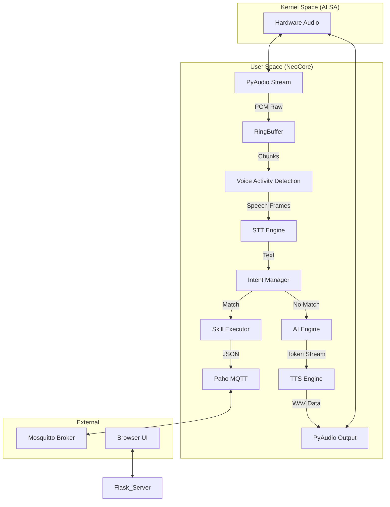
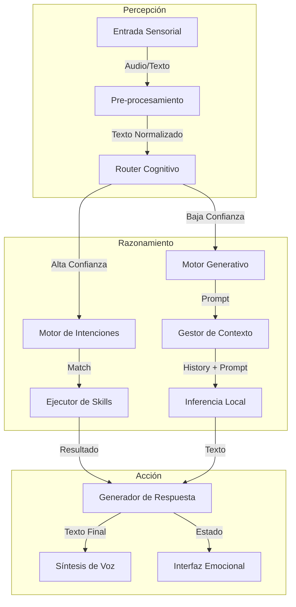

**Proyecto Fin de Ciclo:**

**NEOPapaya**
**(COpiloto  Local para Entornos de Grupo y Administración)**

**Índice**

**[1\. Objetivo principal de tu proyecto	5](#objetivo-principal-de-tu-proyecto)**

[1.1. Herramientas  a usar	5](#1.1.-herramientas-a-usar)

[**2\. Descripción del proyecto	5**](#2.-descripción-del-proyecto)

[**3\. Descripción del Entorno de Desarrollo y Despliegue	6**](#3.-descripción-del-entorno-de-desarrollo-y-despliegue)

[3.1 Entorno de desarrollo	6](#3.1-entorno-de-desarrollo)

[3.2 Entorno de Despliegue	6](#3.2-entorno-de-despliegue)

[**3\. Estudio de Necesidades y Requisitos Funcionales	7**](#4.-estudio-de-necesidades-y-requisitos-funcionales)

[3.1 Requisitos Funcionales	7](#3.1-requisitos-funcionales)

[3.2 Requisitos No Funcionales	8](#3.2-requisitos-no-funcionales)

[**4\. Recursos y Planificación	8**](#4.-recursos-y-planificación)

[4.1 Planificación aproximada:	8](#4.1-planificación-aproximada:)

[4.1. Identificación y gestión de riesgos	9](#4.1.-identificación-y-gestión-de-riesgos)

[5\. Propuesta técnica	9](#heading=)

[5.1 Capa de Percepción (Inputs o Entrada):	9](#5.1-capa-de-percepción-\(inputs-o-entrada\):)

[5.2 Capa Cognitiva (Procesamiento):	9](#heading=)

[5.3 Capa de accion y gestion (salidas):	9](#5.3-capa-de-accion-y-gestion-\(salidas\):)

[5.4 Stack tecnologico	10](#5.4-stack-tecnologico)

[**6\. Justificación de la propuesta	10**](#6.-justificación-de-la-propuesta)

[**7\. Implantación	10**](#7.-implantación)

[7.1 Requisitos de despliegue	10](#7.1-requisitos-de-despliegue)

[7.2 Proceso de instalación	11](#7.2-proceso-de-instalación)

[**ANEXO I: Manual de Usuario y Administración	11**](#anexo-i:-manual-de-usuario-y-administración)

[1\. INSTALACIÓN Y DESPLIEGUE	11](#1.-instalación-y-despliegue)

[1.1 Requisitos del sistema	11](#1.1-requisitos-del-sistema)

[1.1.1 Hardware	11](#1.1.1-hardware)

[1.1.2 Software	11](#1.1.2-software)

[1.2 Preparación del entorno	12](#1.2-preparación-del-entorno)

[1.3 Proceso de Instalación Automatizada	12](#1.3-proceso-de-instalación-automatizada)

[1.4 Verificación de la instalación	12](#1.4-verificación-de-la-instalación)

[1.5 Configuración del Modo Kiosk	12](#1.5-configuración-del-modo-kiosk)

[2\. CONFIGURACIÓN DEL SISTEMA	13](#2.-configuración-del-sistema)

[2.1 Archivo de configuración Principal (config.json)	13](#2.1-archivo-de-configuración-principal-\(config.json\))

[2.2 Personalización de la Palabra de Activación	13](#2.2-personalización-de-la-palabra-de-activación)

[2.3 Configuración de Modelos de IA	13](#2.3-configuración-de-modelos-de-ia)

[2.4 Configuración de Red y MQTT	13](#2.4-configuración-de-red-y-mqtt)

[2.5 Gestión de Usuarios y Permisos	14](#2.5-gestión-de-usuarios-y-permisos)

[3\. MANUAL DE USUARIO	14](#3.-manual-de-usuario)

[3.1 Interacción por Voz	14](#3.1-interacción-por-voz)

[3.1.1 Comandos de Sistema	14](#3.1.1-comandos-de-sistema)

[3.1.2 Comandos de Red y SSH	14](#3.1.2-comandos-de-red-y-ssh)

[3.1.3 Comandos de Organización	14](#3.1.3-comandos-de-organización)

[3.1.4 Comandos Multimedia	14](#3.1.4-comandos-multimedia)

[3.2 Interacción Conversacional (Gemma 2B)	14](#3.2-interacción-conversacional-\(gemma-2b\))

[3.3 Interfaz Visual (Web UI)	14](#3.3-interfaz-visual-\(web-ui\))

[3.3.1 Estado de la “Cara”	15](#3.3.1-estado-de-la-“cara”)

[3.4 Uso del explorador de archivos	15](#3.4-uso-del-explorador-de-archivos)

[4\. MANUAL DE ADMINISTRACIÓN	15](#4.-manual-de-administración)

[4.1 Gestión del Servicio (systemd)	15](#4.1-gestión-del-servicio-\(systemd\))

[4.2 Monitorización y Logs	15](#4.2-monitorización-y-logs)

[4.3 Administración remota (SSH Manager)	15](#4.3-administración-remota-\(ssh-manager\))

[4.4 Seguridad y “Guard”	16](#4.4-seguridad-y-“guard”)

[4.5 Mantenimiento y Actualizaciones	16](#4.5-mantenimiento-y-actualizaciones)

[5\. CONFIGURACION AVANZADA	16](#5.-configuracion-avanzada)

[5.1 Ajuste Fino de Vosk	16](#5.1-ajuste-fino-de-vosk)

[5.2 Personalización de la UI Web	16](#5.2-personalización-de-la-ui-web)

[5.3 Parámetros Ocultos	16](#5.3-parámetros-ocultos)

[**ANEXO II: Manual Técnico de Despliegue	17**](#anexo-ii:-manual-técnico-de-despliegue)

[1\. INTRODUCCIÓN TÉCNICA	17](#1.-introducción-técnica)

[1.1 Propósito	17](#1.1-propósito)

[1.2 Stack Tecnológico Detallado	17](#1.2-stack-tecnológico-detallado)

[1.3 Filosofía de diseño	17](#1.3-filosofía-de-diseño)

[2\. ARQUITECTURA INTERNA Y FLUJO DE DATOS	17](#2.-arquitectura-interna-y-flujo-de-datos)

[2.1 Diagrama de Componentes (Nivel de Kernel)	17](#2.1-diagrama-de-componentes-\(nivel-de-kernel\))

[2.2 Esquema de Mensajeria MQTT (Network Bros)	18](#2.2-esquema-de-mensajeria-mqtt-\(network-bros\))

[2.3 Proceso de Audio (ALSA \-\> VAD \-\> STT)	20](#2.3-proceso-de-audio-\(alsa--\>-vad--\>-stt\))

[2.4 Gestión de Memoria y Ciclo de Vida	20](#2.4-gestión-de-memoria-y-ciclo-de-vida)

[3\. INSTALACIÓN DE BAJO NIVEL	20](#3.-instalación-de-bajo-nivel)

[3.1 Compilación de Dependencias Críticas	20](#3.1-compilación-de-dependencias-críticas)

[3.2 Configuración del Entorno Python	21](#3.2-configuración-del-entorno-python)

[3.3 Despliegue de modelos (GGUF &amp; ONNX)	21](#3.3-despliegue-de-modelos-\(gguf-&-onnx\))

[4\. RETOQUES Y OPTIMIZACIÓN DEL KERNEL	22](#4.-retoques-y-optimización-del-kernel)

[4.1 Parámetros Sysctl para Baja Latencia	22](#4.1-parámetros-sysctl-para-baja-latencia)

[4.2 Configuración de Prioridad de Procesos	22](#4.2-configuración-de-prioridad-de-procesos)

[4.3 Gestión de Memoria	22](#4.3-gestión-de-memoria)

[4.4 Gobernanza de CPU	23](#4.4-gobernanza-de-cpu)

[5\. SEGURIDAD Y HARDENING AVANZADO	23](#5.-seguridad-y-hardening-avanzado)

[7.1 Aislamiento de la red	23](#7.1-aislamiento-de-la-red)

[7.2 Políticas AppArmor/SELinux	23](#7.2-políticas-apparmor/selinux)

[7.3 Protección contra Fuerza Bruta	24](#7.3-protección-contra-fuerza-bruta)

[7.4 Gestión de Secretos y Certificados SSL	24](#7.4-gestión-de-secretos-y-certificados-ssl)

[8\. ANEXOS TECNICOS	25](#8.-anexos-tecnicos)

[8.1 Mapa de Memoria	25](#8.1-mapa-de-memoria)

[**ANEXO III: ARQUITECTURA INTERNA E INTELIGENCIA ARTIFICIAL	25**](#anexo-iii:-arquitectura-interna-e-inteligencia-artificial)

[1\. INTRODUCCIÓN A LA COGNICIÓN ARTIFICIAL	25](#1.-introducción-a-la-cognición-artificial)

[1.1 Diseño: Hibrido Determinista-Generativo	25](#1.1-diseño:-hibrido-determinista-generativo)

[1.2 El Bucle Cognitivo (Percepción-Acción)	26](#1.2-el-bucle-cognitivo-\(percepción-acción\))

[1.3 Principios de Diseño Ético y Seguridad	27](#1.3-principios-de-diseño-ético-y-seguridad)

[2\. ARQUITECTURA COGNITIVA	28](#2.-arquitectura-cognitiva)

[2.1 Diagrama de Bloques Funcionales	28](#2.1-diagrama-de-bloques-funcionales)

[2.2 Pipeline de Procesamiento de Señales	28](#2.2-pipeline-de-procesamiento-de-señales)

[2.3 Máquina de Estados Emocional	29](#2.3-máquina-de-estados-emocional)

[2.4 Gestión de Prioridades y Atención	30](#2.4-gestión-de-prioridades-y-atención)

[3\. COMPRENSIÓN DEL LENGUAJE NATURAL (NLU)	30](#3.-comprensión-del-lenguaje-natural-\(nlu\))

[3.1 Enfoque Híbrido: Fuzzy Logic  (Lógica difusa) vs Neural Networks (Red Neuronal)	30](#3.1-enfoque-híbrido:-fuzzy-logic-\(lógica-difusa\)-vs-neural-networks-\(red-neuronal\))

[3.2 Algoritmo de Clasificación de Intents (RapidFuzz)	30](#3.2-algoritmo-de-clasificación-de-intents-\(rapidfuzz\))

[3.3 Redes Neuronales Superficiales (Padatious)	31](#3.3-redes-neuronales-superficiales-\(padatious\))

[4\. EL “CEREBRO” (SISTEMA DE MEMORIA)	31](#4.-el-“cerebro”-\(sistema-de-memoria\))

[4.1 Memoria a Corto Plazo	31](#4.1-memoria-a-corto-plazo)

[4.2 Memoria a Largo Plazo (SQLite)	31](#4.2-memoria-a-largo-plazo-\(sqlite\))

[4.3 Esquemas de Base de Datos	31](#4.3-esquemas-de-base-de-datos)

[4.4 Aprendizaje Adaptativo (Alias y Preferencias)	32](#4.4-aprendizaje-adaptativo-\(alias-y-preferencias\))

[5\. INTELIGENCIA GENERATIVA (LLM)	32](#5.-inteligencia-generativa-\(llm\))

[5.1 Integración de Llama.cpp	32](#5.1-integración-de-llama.cpp)

[5.2 Ingenieria de Prompts Avanzada	32](#5.2-ingenieria-de-prompts-avanzada)

[5.3 Estrategias de Muestreo	32](#5.3-estrategias-de-muestreo)

[5.4 Optimización de Interferencia	33](#5.4-optimización-de-interferencia)

[5.5 Fine-Tuning y LoRA	33](#5.5-fine-tuning-y-lora)

[**ANEXO IV: RESOLUCIÓN DE PROBLEMAS	33**](#anexo-iv:-resolución-de-problemas)

[1\. PROBLEMAS DE USUARIO FINAL	33](#1.-problemas-de-usuario-final)

[1.1 Problemas de Audio	33](#1.1-problemas-de-audio)

[1.2 Problemas de Reconocimiento de Voz	33](#1.2-problemas-de-reconocimiento-de-voz)

[1.3 Problemas de Conectividad	33](#1.3-problemas-de-conectividad)

[1.4 Problemas del Modelo LLM	34](#1.4-problemas-del-modelo-llm)

[2\. PROBLEMAS DE INGENIERÍA Y DESPLIEGUE	34](#2.-problemas-de-ingeniería-y-despliegue)

[2.1 Resolución de errores en la compilación	34](#2.1-resolución-de-errores-en-la-compilación)

[2.2 Depuración con GDB	34](#2.2-depuración-con-gdb)

[3\. CÓDIGOS DE ERROR INTERNOS	34](#3.-códigos-de-error-internos)

**Anteproyecto:**

1. # **Objetivo principal de tu proyecto**

   Desarrollar un asistente inteligente modular (NEOPapaya: Copiloto de Lenguaje para Entornos de Grupo y Administración) diseñado específicamente para optimizar tareas de administración de sistemas y gestión de infraestructuras IT, operando de forma 100% local para garantizar la soberanía de los datos.

   El proyecto aborda la necesidad de una automatización inteligente capaz de ejecutar comandos complejos (Shell/Bash) mediante lenguaje natural, sin depender de APIs de terceros ni conexión a internet. A diferencia de los asistentes comerciales genéricos, NEOPapaya combina:

* **Inteligencia Híbrida:** Un motor de reglas determinista para acciones críticas (start/stop servicios) junto con Modelos de Lenguaje Pequeños (SLMs como Gemma 2B y MANGO T5) para razonamiento y comprensión contextual.
* **Seguridad Proactiva:** Módulos integrados (NEOPapayaGuard) para la detección de intrusiones y monitorización de anomalías en tiempo real.
* **Eficiencia en Recursos:** Optimización profunda para hardware de consumo (doble núcleo, 8GB RAM), permitiendo su despliegue en servidores perimetrales o estaciones de trabajo estándar.

Este enfoque permite a las empresas y administradores reducir la carga cognitiva en tareas repetitivas, mantener un control estricto sobre la privacidad de la información y disponer de una interfaz de operación multimodal (Voz, Web, Terminal) altamente personalizable.

## **1.1. Herramientas  a usar**

* **Lenguajes de Programación:**
  * **Python 3.10+:** Lenguaje principal del Core (NeoCore) y módulos de IA. Se prioriza la estabilidad y compatibilidad.
  * **Bash/Shell:** Scripts de despliegue (`install.sh`) y automatización del sistema.
  * **HTML5 / CSS3 / JavaScript (Vanilla):** Interfaz web responsiva y ligera.
* **Inteligencia Artificial (Local):**
  * **Conversación (LLM):** Gemma 2B It (vía `llama-cpp-python` y GGUF 4-bit) para razonamiento y diálogo.
  * **Comandos (T5):** MANGO T5 (vía `transformers`) para traducción precisa de Lenguaje Natural a Bash.
  * **Voz (STT/TTS):** Vosk (offline ultrarrápido) y Whisper (precisión) para entrada; Piper TTS para síntesis de voz neural.
* **Frameworks y Soluciones:**
  * **Backend Web:** Flask y Flask-SocketIO para comunicación en tiempo real.
  * **Visión Artificial:** OpenCV y `face_recognition` para detección biométrica (opcional en despliegue sysadmin).
  * **Sistema:** `psutil` para métricas de hardware y `systemd` para gestión de demonios.

# **2\. Descripción del proyecto**

NEOPapaya nace de la necesidad de un asistente personal, privado y autónomo, centrado en la administración de sistemas. La idea principal de su diseño es eliminar cualquier dependencia de la nube, garantizando que los datos pertenecen exclusivamente al usuario.

El desarrollo se fundamenta en tres pilares clave:

* **Privacidad y Soberanía:** A diferencia de los asistentes comerciales, NEOPapaya se ejecuta 100% en local. No hay envío de audio ni telemetría externa.
* **Eficiencia:** Diseñado para hardware modesto (desde Raspberry Pi hasta estaciones de trabajo), optimizando el uso de recursos para democratizar el acceso a asistentes inteligentes sin requerir GPUs costosas.
* **Modularidad:** Arquitectura abierta basada en Python que permite ampliar funciones fácilmente.

**Evolución del Proyecto:**

Inicialmente concebido como *NEOPapaya* (un asistente para el cuidado de mayores), el proyecto pivotó hacia una herramienta técnica para administradores de sistemas (*SysAdmin AI*), refactorizando el código para eliminar dependencias gráficas (GUI) y centrarse en la operación "headless" y por consola. En la fase actual, se ha integrado inteligencia generativa local (Gemma y MANGO) para potenciar sus capacidades.

# **3. Descripción del Entorno de Desarrollo y Despliegue**

## **3.1 Entorno de desarrollo**

El sistema operativo seleccionado para el despliegue es **Debian 12 (Bookworm)** debido a su estabilidad y bajo consumo de recursos, aunque también es compatible con Ubuntu 22.04 LTS y Raspberry Pi OS (64-bit).

Para el desarrollo se ha utilizado principalmente **Python 3.10**, aprovechando su amplio ecosistema de inteligencia artificial.

**Stack Tecnológico clave:**

* **Gestión de Dependencias:** `pip` y `venv` para aislamiento.
* **Control de Versiones:** Git y GitHub.
* **Librerías Principales:** `torch` (PyTorch) para IA, `vosk` y `faster-whisper` para STT, `flask` para el backend web.
* **Orquestación:** Systemd (User Units) para la gestión del ciclo de vida del servicio.

## **3.2 Entorno de Despliegue**

La arquitectura del proyecto es híbrida y distribuida, utilizando tres nodos principales:

1. **Nodo Central (Core x86):** Lenovo Yoga 530-14IKB.

   * **CPU:** Intel Core i3-7020U (2 núcleos / 4 hilos).
   * **RAM:** 8GB DDR4.
   * **Función:** Ejecuta `NeoCore`, el LLM (Gemma 2B) y el servidor web.
2. **Agente Satélite (ARM):** Raspberry Pi 4B.

   * **CPU:** Broadcom BCM2711.
   * **RAM:** 4GB.
   * **Función:** Nodo de voz distribuido y control IoT local.
3. **Sensor IoT (Microcontrolador):** ESP32-WROOM-32E.

   * **Función:** Telemetría ambiental y demostración de conectividad MQTT / Bluetooth.

# **4. Estudio de Necesidades y Requisitos Funcionales**

NEOPapaya se posiciona como una herramienta de apoyo ("Copiloto") para administradores de sistemas, cubriendo el nicho de la automatización por voz segura y desconectada.

**Necesidades que cubre:**

* **Operación "Manos Libres":** Permite consultar estados o ejecutar scripts mientras se trabaja físicamente en hardware (rack, cableado).
* **Seguridad de la Información:** Garantiza que las contraseñas, IPs y datos de infraestructura nunca salgan de la red local.
* **Extensibilidad:** Permite añadir nuevos comandos mediante scripts simples de Python, sin depender de "Skills" en la nube que pueden ser revocadas.

## **4.1 Requisitos Funcionales**

1. **Interacción Natural:**
   * **Voz:** Transcripción offline de alta precisión (Vosk/Whisper) y síntesis neural (Piper).
   * **Comprensión:** Traducción de lenguaje natural a comandos estructurados (Gemma/Mango).
2. **Gestión de Sistemas (SysAdmin):**
   * **Ejecución de Comandos:** Capacidad de entender y ejecutar órdenes de Bash complejas.
   * **Monitorización:** Lectura de logs en tiempo real y métricas de vitalidad (CPU/RAM).
   * **Red:** Diagnóstico mediante herramientas estándar (`ping`, `nmap`, `dig`).
3. **Seguridad (NEOPapayaGuard):**
   * Detección pasiva de intentos de intrusión (análisis de `auth.log`).
   * Alertas de voz ante anomalías críticas.

## **4.2 Requisitos No Funcionales**

1. **Privacidad Absoluta (Local-First):** Funcionamiento 100% offline obligatorio.
2. **Rendimiento en Hardware Modesto:** El núcleo debe consumir < 2GB RAM en reposo para coexistir con otros servicios.
3. **Latencia Baja:** Tiempo de respuesta para comandos críticos < 1 segundo.
4. **Resiliencia:** Capacidad de autorrecuperación de hilos (Watchdog) ante fallos de drivers.

# **5. Recursos y Planificación**

Los recursos de hardware son los descritos en el apartado 3.2. A nivel de recursos humanos, el proyecto es desarrollado por un único ingeniero, apoyado por la comunidad Open Source.

## **5.1 Planificación (Roadmap)**

1. **Fase 1 (Completada):** Prototipo funcional, reconocimiento de voz y ejecución de comandos básicos.
2. **Fase 2 (Completada):** Modularización (NeoCore), integración de LLM (Gemma) y Web UI v2.
3. **Fase 3 (Actual):** Implementación de **Mango T5** (NL2Bash), seguridad con **NEOPapayaGuard** y optimización de hilos (Core v4).
4. **Fase 4 (Futura):** Interfaz Web Reactiva v3 y soporte completo para clústeres MNB (Mango Node Bros).

## **5.2 Identificación y gestión de riesgos**

* **Rendimiento en SBC:** Riesgo de sobrecalentamiento o cuello de botella en Raspberry Pi 4. *Mitigación:* Uso eficiente de hilos y modelos cuantizados (4-bit).
* **Alucinaciones del LLM:** Riesgo de ejecución de comandos peligrosos. *Mitigación:* Lista blanca de comandos y confirmación explícita para acciones destructivas.
* **Dependencias de Hardware:** Problemas con drivers de audio (ALSA). *Mitigación:* Implementación de Watchdogs de audio.

# **6. Propuesta Técnica**

NEOPapaya (v3.0 / Core v4) implementa una arquitectura modular dirigida por eventos, diseñada para desacoplar la percepción (sensores) de la cognición (IA) y la acción (actuadores).

El núcleo, **NeoCore**, actúa como un bus de mensajes local de baja latencia.

## **6.1 Capa de Percepción (Inputs)**

* **Voice Manager:** Motor híbrido que alterna entre **Vosk** (comandos rápidos con gramática restringida) y **Whisper** (dictado libre). Incluye VAD (Voice Activity Detection) para minimizar el procesamiento de silencio.
* **Vision Manager:** Pipeline optimizado de visión artificial que detecta movimiento y rostros para despertar el sistema ("Wake-on-Face"), ahorrando energía cuando no hay usuarios presentes.

## **6.2 Capa Cognitiva (Procesamiento)**

* **Intent Manager:** Clasificador de reglas difusas (`RapidFuzz`) para comandos deterministas inmediatos.
* **AI Engine (Gemma):** Modelo Generativo (SLM) de 2B parámetros para mantener conversaciones fluidas y proporcionar respuestas de conocimiento general.
* **Mango Manager (T5):** Modelo especializado (Fine-Tuned) para la traducción de Lenguaje Natural a Comandos Bash (`NL2Bash`), el corazón de la propuesta SysAdmin.
* **Brain:** Memoria episódica persistente (SQLite) que almacena alias, historial y preferencias del usuario.

## **6.3 Capa de Acción y Gestión (Outputs)**

* **SysAdmin Manager:** Ejecutor seguro de comandos de sistema. Gestiona servicios systemd, actualizaciones y monitorización de hardware.
* **Speaker (TTS):** Síntesis de voz neuronal local mediante **Piper**, ofreciendo voces naturales con un coste computacional mínimo.
* **Web Admin:** Interfaz gráfica reactiva para control visual y configuración remota.

## **6.4 Stack Tecnológico**

* **Lenguaje:** Python 3.10.
* **IA Frameworks:** PyTorch (Mango), Llama.cpp (Gemma).
* **Audio Backend:** PyAudio (ALSA directo).
* **Event Bus:** MQTT (Mosquitto) para comunicación entre nodos.

# **7. Justificación de la propuesta**

Este sistema solventa tres necesidades críticas en la Administración de sistemas:

1. **Soberanía de Datos y Seguridad:** En entornos corporativos o con infraestructura crítica, el uso de asistente comerciales (Alexa, Google Assistant), pone en riesgo la seguridad de la información, con TIO se garantiza que todos los datos sean procesados de manera local.
2. **Manos libres en entornos técnicos:** Un administrador de sistemas a menudo realiza tareas físicas donde el acceso a un teclado puede ser incómodo. Con TIO pueden hacer consultas sobre el estado de un sistema, recibir información de red o desplegar contenedores entre otros, optimizando flujos de trabajo
3. **Código Abierto:** Su código abierto y su arquitectura modular permiten que se agreguen plugins y nuevas características con solo un par de líneas de código, esto permite a los administradores, personalizar el sistema a sus necesidades.

# **8. Implantación**

## **8.1 Requisitos de despliegue**

El despliegue del sistema requiere de un entorno Linux compatible con una arquitectura x86\_64. Los requisitos mínimos son los siguientes:

- **Sistema Operativo:** Debian 11/12
- **Hardware:**
  - **RAM:** Mínimo 4Gb (LLM Ligero Phi3 o TinyLlama ). Recomendado 8GB
  - **CPU:** Procesador x86\_64 compatible con el set de instrucciones AVX2
  - **Disco Duro:** SSD o Nvme 64Gb mínimo
- **Conectividad:** Para la primera instalación se requiere una conexión a internet ya que hay que descargar una gran cantidad de datos.

## **8.2 Proceso de instalación**

El proceso de instalación se ha simplificado mediante un script ([install.sh](http://install.sh)), que automatiza todo el despliegue del sistema:

1. **Detección y preparación:** El script identifica la versión de Debian e instala las dependencias necesarias.
2. **Entorno aislado:** Se configura un entorno virtual de python (venv) para evitar conflictos con librerías del sistema.
3. **Descarga de modelos:** Se obtienen y verifican mediante hash los modelos de inteligencia artificial, modelos acústicos y voces.
4. **Demonización:** Se genera una archivo de systemd, para que el asistente se inicie automáticamente con el sistema

# **9. Viabilidad y Aspectos Económicos**

Para dotar al proyecto de un marco realista, se plantea su desarrollo e implantación bajo el paraguas de una empresa ficticia especializada en soluciones Open Source.

## **9.1 Perfil de Empresa: SysAI Solutions**

**SysAI Solutions** es una consultora tecnológica emergente enfocada en la democratización de la Inteligencia Artificial para PyMEs y departamentos de IT.

* **Misión:** Proveer herramientas de automatización seguras y privadas que reduzcan la carga de trabajo repetitiva de los administradores de sistemas.
* **Modelo de Negocio:**
  * **Consultoría e Implantación:** Despliegue de asistentes NEOPapaya personalizados en la infraestructura del cliente (On-Premise).
  * **Soporte Técnico:** Mantenimiento, actualización de modelos y resolución de incidencias.
  * **Personalización:** Desarrollo de "Skills" a medida para integrar NEOPapaya con CRMs, ERPs o herramientas de monitorización específicas (Zabbix, Prometheus).

## **9.2 Estudio de Viabilidad Económica (Presupuesto)**

El siguiente presupuesto detalla los costes estimados para el desarrollo del prototipo funcional (MVP) presentado en este proyecto.

### **9.2.1 Costes de Hardware**

| Concepto                   | Modelo / Detalle                   | Coste Unitario      | Notas                           |
| :------------------------- | :--------------------------------- | :------------------ | :------------------------------ |
| **Nodo Central**     | Lenovo Yoga 530 (Reutilizado)      | 0,00 €             | Amortizado / Hardware existente |
| **Agente Satélite** | Raspberry Pi 4 Model B (4GB)       | 65,00 €            | Nodo de voz y control           |
| **Sensor IoT**       | ESP32-WROOM-32E DevKit             | 8,50 €             | Telemetría                     |
| **Tarjeta SD**       | SanDisk Extreme 64GB               | 12,00 €            | Almacenamiento rápido para RPi |
| **Periféricos**     | Micrófono USB + Altavoz Jack      | 45,00 €            | ReSpeaker / Genérico           |
| **Varios**           | Cableado, fuentes de alimentación | 20,00 €            |                                 |
| **TOTAL HARDWARE**   |                                    | **150,50 €** |                                 |

### **9.2.2 Costes de Desarrollo (Recursos Humanos)**

Estimación basada en el desarrollo de un ingeniero junior-mid para completar las 4 fases del proyecto.

| Fase                      | Tareas Principales                                         | Horas Est.     | Coste/Hora | Total                 |
| :------------------------ | :--------------------------------------------------------- | :------------- | :--------- | :-------------------- |
| **Investigación**  | Selección de stack (Vosk, Gemma), diseño de arquitectura | 30h            | 25,00 €   | 750,00 €             |
| **Desarrollo Core** | NeoCore, Threads, Gestión de eventos                      | 50h            | 30,00 €   | 1.500,00 €           |
| **Integración IA** | Implementación de Llama.cpp, T5 (Mango), Vosk             | 40h            | 30,00 €   | 1.200,00 €           |
| **Front/Doc**       | Interfaz Web, Manuales, Testing                            | 30h            | 25,00 €   | 750,00 €             |
| **TOTAL RRHH**      |                                                            | **150h** |            | **4.200,00 €** |

### **9.2.3 Resumen del Presupuesto**

| Capítulo                          | Importe               |
| :--------------------------------- | :-------------------- |
| **Hardware y Materiales**    | 150,50 €             |
| **Ingeniería y Desarrollo** | 4.200,00 €           |
| **Gastos Generales (10%)**   | 435,05 €             |
| **Subtotal**                 | **4.785,55 €** |
| **IVA (21%)**                | 1.004,97 €           |
| **TOTAL PROYECTO**           | **5.790,52 €** |

Este presupuesto refleja un proyecto de bajo coste de capital (CAPEX) gracias al uso de Hardware de consumo y Software Open Source, concentrando la inversión en el valor intelectual y el desarrollo de software.

# ANEXO I: MANUAL DE USUARIO Y ADMINISTRACIÓN

# PROYECTO NEOPapaya

**Versión del Documento:** 1.2
**Fecha:** 02/12/2025
**Proyecto:** NEOPapaya (Copiloto de Lenguaje para Entornos de Grupo y Administración)

---

## ÍNDICE DE CONTENIDOS

1. [INTRODUCCIÓN](#1-introducción)
   1.1. Propósito del Documento
   1.2. Audiencia Objetivo
   1.3. Alcance del Sistema
   1.4. Glosario de Términos
2. [INSTALACIÓN Y DESPLIEGUE](#2-instalación-y-despliegue)
   2.1. Requisitos del Sistema
   2.1.1. Hardware
   2.1.2. Software
   2.2. Preparación del Entorno
   2.3. Proceso de Instalación Automatizada
   2.4. Verificación de la Instalación
   2.5. Configuración del Modo Kiosk (Interfaz Visual)
3. [CONFIGURACIÓN DEL SISTEMA](#3-configuración-del-sistema)
   3.1. Archivo de Configuración Principal (`config.json`)
   3.2. Personalización de la Palabra de Activación (Wake Word)
   3.3. Configuración de Modelos de IA
   3.4. Configuración de Red y MQTT
   3.5. Gestión de Usuarios y Permisos
4. [MANUAL DE USUARIO](#4-manual-de-usuario)
   4.1. Interacción por Voz
   4.1.1. Comandos de Sistema
   4.1.2. Comandos de Red y SSH
   4.1.3. Comandos de Organización (Calendario, Alarmas)
   4.1.4. Comandos Multimedia
   4.2. Interacción Conversacional (Gemma 2B)
   4.3. Interfaz Visual (Web UI)
   4.3.1. Estados de la "Cara"
   4.3.2. Notificaciones y Alertas
   4.4. Uso del Explorador de Archivos
5. [MANUAL DE ADMINISTRACIÓN](#5-manual-de-administración)
   5.1. Gestión del Servicio `systemd`
   5.2. Monitorización y Logs
   5.3. Gestión de Redes (Network Bros)
   5.4. Administración Remota (SSH Manager)
   5.5. Seguridad y "Guard"
   5.6. Mantenimiento y Actualizaciones
6. [SOLUCIÓN DE PROBLEMAS (TROUBLESHOOTING)](#6-solución-de-problemas)
   (Ver ANEXO IV)
7. [GUÍA DE DESARROLLO (EXTENSIÓN DE SKILLS)](#7-guía-de-desarrollo)
   (Ver ANEXO V)
8. [CONFIGURACIÓN AVANZADA](#8-configuración-avanzada)
   8.1. Ajuste Fino de Vosk
   8.2. Personalización de la UI Web
   8.3. Parámetros Ocultos
9. [SEGURIDAD AVANZADA](#9-seguridad-avanzada)
   9.1. Hardening del Sistema Operativo
   9.2. Configuración de Firewall (UFW)
   9.3. Auditoría de Accesos
10. [GLOSARIO TÉCNICO EXTENDIDO](#10-glosario-técnico-extendido)
    10.1. Términos de IA
    10.2. Términos de Redes
    10.3. Términos del Sistema
11. [LICENCIA Y CRÉDITOS](#11-licencia-y-créditos)
    11.1. Licencia del Proyecto
    11.2. Librerías Open Source Utilizadas
12. [ANEXOS](#12-anexos)
    12.1. Referencia Rápida de Comandos
    12.2. Estructura de Directorios

---

## 1. INTRODUCCIÓN

### 1.1. Propósito del Documento

El presente documento, **ANEXO I: Manual de Usuario y Administración**, tiene como objetivo proporcionar una guía exhaustiva y detallada para la instalación, configuración, uso y administración del sistema **NEOPapaya**. Este manual sirve como referencia tanto para usuarios finales que interactúan con el asistente como para administradores de sistemas encargados de su despliegue y mantenimiento.

### 1.2. Audiencia Objetivo

Este manual está dirigido a dos tipos de usuarios principales:

* **Usuarios Finales:** Personas que utilizarán el asistente para tareas cotidianas, consultas de información, control domótico y gestión básica.
* **Administradores de Sistemas (SysAdmins):** Personal técnico responsable de la instalación en hardware específico (Raspberry Pi, Mini PCs), configuración de red, integración con otros dispositivos y resolución de incidencias técnicas.
* **Desarrolladores:** Programadores que deseen extender la funcionalidad del asistente mediante nuevos módulos o "Skills".

### 1.3. Alcance del Sistema

NEOPapaya es un asistente personal híbrido que combina:

* **Control Determinista:** Ejecución precisa de comandos para tareas críticas (apagar sistema, conectar SSH, gestionar archivos).
* **Inteligencia Generativa:** Uso de un LLM local (Gemma 2B) para mantener conversaciones naturales, responder preguntas complejas y ofrecer una personalidad definida.
* **Gestión de Infraestructura:** Herramientas integradas para el escaneo de redes, gestión de servidores remotos y monitorización de servicios.

### 1.4. Glosario de Términos

* **Wake Word:** Palabra clave que activa la escucha del asistente (ej. "Colega", "Tío").
* **LLM (Large Language Model):** Modelo de lenguaje grande (Gemma 2B) utilizado para generar texto.
* **STT (Speech-to-Text):** Tecnología de reconocimiento de voz (Vosk/Whisper).
* **TTS (Text-to-Speech):** Tecnología de síntesis de voz (Piper).
* **MQTT:** Protocolo de mensajería ligera usado para la comunicación entre agentes ("Network Bros").
* **Kiosk Mode:** Modo de ejecución del navegador a pantalla completa para mostrar la interfaz visual.
* **Skill:** Módulo de software que añade una capacidad específica al asistente (ej. Skill de Spotify, Skill de Domótica).

---

## 2. INSTALACIÓN Y DESPLIEGUE

### 2.1. Requisitos del Sistema

Para garantizar un funcionamiento fluido, especialmente del modelo LLM Gemma 2B, se deben cumplir los siguientes requisitos.

#### 2.1.1. Hardware

* **Procesador (CPU):**
* Arquitectura: ARM64 (Raspberry Pi 4/5) o x86_64 (PC/Portátil).
* Instrucciones: Se recomienda soporte para **AVX2** en x86 para mejorar la inferencia del LLM.
* Núcleos: Mínimo 4 núcleos físicos.
* **Memoria RAM:**
* Mínimo absoluto: 4 GB (El sistema funcionará, pero Gemma será lento y podría sufrir *swapping*).
* Recomendado: **8 GB** o más para una experiencia fluida con el LLM cargado en memoria.
* **Almacenamiento:**
* Tipo: **SSD** (SATA o NVMe) altamente recomendado. Las tarjetas SD estándar pueden causar cuellos de botella severos durante la carga de modelos y escritura de logs.
* Espacio: Mínimo 16 GB libres. Se recomienda 32 GB o más para almacenar modelos, bases de datos y logs.
* **Periféricos de Audio:**
* Micrófono: USB de buena calidad o HAT para Raspberry Pi (ej. ReSpeaker).
* Altavoces: Salida Jack 3.5mm, HDMI o USB.

#### 2.1.2. Software

* **Sistema Operativo:**
* **Debian 11/12 (Bullseye/Bookworm)**: Recomendado para estabilidad.
* **Ubuntu 22.04/24.04 LTS**: Totalmente soportado.
* **Raspberry Pi OS (64-bit)**: Esencial usar la versión de 64 bits para soportar los modelos de IA modernos.
* **Fedora 38+**: Soportado experimentalmente.
* **Dependencias Base:** `git`, `curl`, `python3`.

### 2.2. Preparación del Entorno

Antes de iniciar la instalación, asegúrese de que el sistema esté actualizado y tenga configurada la red.

1. **Actualizar el sistema:**

```bash
 sudo apt update && sudo apt upgrade -y
```

2. **Instalar Git:**

```bash
 sudo apt install git -y
```

3. **Clonar el Repositorio:**
   Descargue el código fuente en el directorio de usuario (se recomienda no usar `root` para la descarga).

```bash
 cd ~
 git clone https://github.com/jrodriiguezg/NEOPapaya.git
 cd NEOPapaya
```

### 2.3. Proceso de Instalación Automatizada

NEOPapaya incluye un script `install.sh` que automatiza la configuración. Este script realiza las siguientes acciones:

1. Detecta el gestor de paquetes (`apt` o `dnf`).
2. Instala dependencias del sistema (compiladores, librerías de audio, herramientas de red).
3. Instala y configura **Pyenv** para gestionar la versión de Python.
4. Instala **Python 3.10** (versión requerida para compatibilidad con ciertas librerías de IA).
5. Crea un entorno virtual (`venv`) e instala las dependencias de Python (`requirements.txt`).
6. Descarga los modelos necesarios:

* Vosk (Reconocimiento de voz).
* Piper (Síntesis de voz).
* Gemma 2B (LLM).
* Faster-Whisper (Opcional, para mayor precisión).

7. Configura el servicio `systemd` para ejecución en segundo plano.

**Ejecución del Script:**

```bash
chmod +x install.sh
./install.sh
```

*Nota: El script solicitará la contraseña de `sudo` para instalar paquetes del sistema.*

### 2.4. Verificación de la Instalación

Una vez finalizado el script, verifique que todo esté correcto:

1. **Comprobar el servicio:**

```bash
 systemctl --user status neo.service
```

 Debe aparecer como `active (running)`.

2. **Verificar Logs en tiempo real:**

```bash
 journalctl --user -u neo.service -f
```

 Busque mensajes como "NEOPapaya Core iniciado", "Modelos cargados correctamente".

3. **Prueba de Audio:**
   El sistema debería emitir un sonido de inicio o un saludo verbal si los altavoces están configurados correctamente.

### 2.5. Configuración del Modo Kiosk (Interfaz Visual)

Si dispone de una pantalla conectada, el instalador puede configurar un modo "Kiosk" para mostrar la cara del asistente automáticamente al inicio.

El script configura:

* Auto-login en la terminal `tty1`.
* Inicio automático del servidor gráfico (`startx`).
* Lanzamiento de `Chromium` en modo pantalla completa apuntando a `http://localhost:5000/face`.

Para activar/desactivar esto manualmente, revise el archivo `~/.xinitrc`.

---

## 3. CONFIGURACIÓN DEL SISTEMA

### 3.1. Archivo de Configuración Principal (`config.json`)

Toda la configuración reside en `config/config.json`. Este archivo es un JSON estándar que puede editarse con cualquier editor de texto.

**Estructura Básica:**

```json
{
 "secret_key": "...",
 "stt": {
 "engine": "vosk",
 "input_device_index": 10
 },
 "web_admin": {
 "host": "0.0.0.0",
 "port": 5000,
 "debug": false
 },
 "audio": {
 "jack_no_start_server": "1",
 "driver": "alsa"
 },
 "ai_model_path": "models/gemma-2b-it-q4_k_m.gguf",
 "experimental": {
 "voice_auth_enabled": false
 },
 "mqtt": {
 "broker": "localhost",
 "port": 1883
 }
}
```

```

### 3.2. Personalización de la Palabra de Activación (Wake Word)

Para cambiar el nombre al que responde el asistente:
1. Edite `config/config.json`.
2. Modifique el valor de `"wake_word"`. Puede ser una lista de palabras.
 ```json
 "wake_word": ["colega", "tío", "robot"]
```

3. Reinicie el servicio:

```bash
 systemctl --user restart neo.service
```

### 3.3. Configuración de Modelos de IA

* **LLM (Gemma):** La ruta al modelo `.gguf` se define en `ai_model_path`. Si desea usar un modelo diferente (ej. TinyLlama), descargue el archivo `.gguf` en la carpeta `models/` y actualice la ruta.
* **Voz (Piper):** Los modelos de voz se encuentran en `piper/`. Para cambiar la voz, debe descargar el modelo `.onnx` y su `.json` correspondiente, y actualizar las referencias en el código o configuración (actualmente la selección de voz suele estar hardcodeada en `Speaker.py` o config, revisar `modules/speaker.py`).

### 3.4. Configuración de Red y MQTT

NEOPapaya utiliza MQTT para comunicarse con otros dispositivos ("Network Bros").

* **Broker:** Por defecto usa `localhost`. Si tiene un broker central en la red, cambie `"broker": "IP_DEL_BROKER"`.
* **Topic Base:** Los agentes publican en `home/agents/{hostname}/...`.

### 3.5. Gestión de Usuarios y Permisos

El asistente se ejecuta en el espacio de usuario (User Mode). Esto es más seguro que ejecutarlo como `root`. Sin embargo, algunas acciones (como `shutdown` o `reboot`) requieren permisos.

* Asegúrese de que el usuario tenga permisos de `sudo` sin contraseña para comandos específicos si es necesario, o utilice `polkit` para gestionar permisos de apagado/reinicio.

---

## 4. MANUAL DE USUARIO

### 4.1. Interacción por Voz

La forma principal de interactuar es mediante la voz. Diga la palabra de activación seguida del comando.

#### 4.1.1. Comandos de Sistema

* **Apagar/Reiniciar:** "Colega, apaga el sistema", "Colega, reinicia el ordenador".
* **Estado:** "Colega, ¿cómo estás?", "Colega, dame un diagnóstico del sistema".
* **Volumen:** "Colega, sube el volumen", "Colega, silencio".

#### 4.1.2. Comandos de Red y SSH

* **IP Pública:** "Colega, ¿cuál es mi IP pública?".
* **Escaneo de Red:** "Colega, escanea la red en busca de intrusos".
* **Ping:** "Colega, haz un ping a google.com".
* **SSH:** "Colega, conéctate al servidor principal", "Colega, ejecuta 'ls -la' en el servidor".

#### 4.1.3. Comandos de Organización

* **Hora/Fecha:** "¿Qué hora es?", "¿Qué día es hoy?".
* **Alarmas:** "Pon una alarma a las 8 de la mañana".
* **Temporizadores:** "Pon un temporizador de 10 minutos para la pasta".
* **Recordatorios:** "Recuérdame comprar leche mañana a las 5".
* **Calendario:** "¿Qué tengo en la agenda para hoy?".

#### 4.1.4. Comandos Multimedia

* **Radio:** "Pon la radio", "Pon Rock FM".
* **Cast:** "Envía este video a la tele del salón".

#### 4.1.5. Comandos de Contenedores (Docker)

Ahora potenciados por **MANGO T5**, lo que permite una mayor flexibilidad en el lenguaje natural.

* **Estado:** "¿Qué contenedores hay?", "Dime los dockers activos", "Lista de contenedores". (MANGO interpretará tu intención y ejecutará el comando `docker ps` adecuado).
* **Gestión:** "Reinicia el contenedor pihole", "Para el contenedor de base de datos".
* *Nota:* Comandos críticos requerirán confirmación ("¿Seguro que quieres reiniciar...?").

#### 4.1.6. Filtrado Inteligente de Salida (Smart Output)

NEOPapaya procesa inteligentemente las respuestas largas de comandos para no saturar el canal de voz:

* **Listas (`ls`):** Si hay muchos archivos, dirá el total y leerá solo los primeros 3.
* **Logs:** Leerá solo las últimas 2 líneas para dar el contexto más reciente.
* **Salidas Extensas:** Si el resultado supera los 400 caracteres, lo guardará automáticamente en un archivo de texto y te avisará de su ubicación, en lugar de leerlo entero.

### 4.2. Interacción Conversacional (Gemma 2B)

Si el comando no coincide con una instrucción predefinida, NEOPapaya usará su "cerebro" (Gemma 2B) para responder.

* **Preguntas generales:** "¿Quién fue Nikola Tesla?", "¿Cuál es la capital de Australia?".
* **Conversación:** "Hola, ¿qué tal te sientes hoy?", "Cuéntame un chiste".
* **Razonamiento:** "Tengo tres manzanas y me como una, ¿cuántas quedan?".

*Nota: Las respuestas generativas pueden tardar unos segundos dependiendo del hardware.*

### 4.3. Interfaz Visual (Web UI)

La interfaz web (`http://localhost:5000/face`) ha sido rediseñada con el tema **"Cosmic"**, una estética moderna con efectos de cristal (glassmorphism).

#### 4.3.1. Características de la Interfaz

* **Tema Adaptable:** Botón en la cabecera (Sol/Luna) para alternar instantáneamente entre **Modo Oscuro** (tonos violetas profundos) y **Modo Claro** (tonos grises y azules suaves).
* **Estados de la "Cara":**
* **Idle (Reposo):** Ojos parpadeando suavemente. Esperando comando.
* **Listening (Escuchando):** Ojos abiertos o indicador visual activo. El sistema está capturando audio.
* **Thinking (Pensando):** Animación de carga. El LLM está procesando la respuesta.
* **Speaking (Hablando):** La boca (si la hay) o los ojos se mueven al ritmo de la voz.
* **Responsividad:** La barra lateral y paneles como el explorador de archivos se adaptan automáticamente a móviles y tablets.

#### 4.3.2. Notificaciones y Alertas

Las alertas del sistema (ej. "CPU caliente", "Intruso detectado en red") aparecen como pop-ups superpuestos en la interfaz visual.

### 4.4. Uso del Explorador de Archivos

NEOPapaya permite buscar archivos localmente.

* **Búsqueda:** "Busca el archivo 'presupuesto.pdf'".
* **Lectura:** "Léeme el archivo 'notas.txt'".

### 4.5. Gestión del Conocimiento (RAG)

NEOPapaya puede aprender de tus documentos.

1. Ve a la web `http://localhost:5000/knowledge`.
2. Arrastra archivos `.pdf`, `.txt` o `.md` al área de subida.
3. Pulsa el botón **"Entrenar / Re-indexar"**.
4. Después, puedes preguntar sobre el contenido: "¿Qué dice el manual sobre la seguridad?".

---

## 5. MANUAL DE ADMINISTRACIÓN

### 5.1. Gestión del Servicio `systemd`

El servicio se llama `neo.service` y corre a nivel de usuario.

* **Iniciar:** `systemctl --user start neo.service`
* **Detener:** `systemctl --user stop neo.service`
* **Reiniciar:** `systemctl --user restart neo.service`
* **Ver Estado:** `systemctl --user status neo.service`
* **Habilitar al inicio:** `systemctl --user enable neo.service`

### 5.2. Monitorización y Logs

Los logs son vitales para el diagnóstico. Se almacenan en `logs/` y en el journal del sistema.

* **Ver logs en vivo:** `journalctl --user -u neo.service -f`
* **Rotación de logs:** El sistema gestiona automáticamente los archivos en `logs/` para no llenar el disco, pero se recomienda revisarlos periódicamente.

### 5.3. Gestión de Redes (Network Bros)

El módulo `NetworkManager` y `MQTTManager` permiten la interoperabilidad.

* **Añadir nuevos agentes:** Simplemente configure otro dispositivo con un cliente MQTT que publique en el topic `home/agents/NUEVO_AGENTE/status`. NEOPapaya lo detectará automáticamente.
* **Seguridad:** Revise `modules/guard.py` para configurar reglas de bloqueo de IPs o alertas de escaneo de puertos.

### 5.4. Administración Remota (SSH Manager)

Los perfiles SSH se guardan (cifrados o en texto plano según configuración) en la base de datos o JSON.

* **Añadir servidor:** Actualmente se realiza editando la configuración o mediante comandos de voz si la función de "aprender servidor" está habilitada.
* **Seguridad:** Las claves SSH deben gestionarse mediante `ssh-agent` del sistema operativo para evitar guardar contraseñas en texto plano.

### 5.5. Seguridad y "Guard"

El módulo `Guard` monitorea logs del sistema (ej. `/var/log/auth.log`) en busca de intentos fallidos de acceso.

* **Configuración:** En `config.json` puede definir el umbral de intentos fallidos antes de lanzar una alerta.
* **Alertas:** Las alertas se anuncian por voz y se muestran en la UI.

### 5.7. Gestión de Contenedores (Docker)

En `http://localhost:5000/docker` encontrará un panel dedicado:

* Visualización de contenedores activos/inactivos.
* Botones de control rápido (Start, Stop, Restart).
* **Logs en tiempo real:** Haga clic en "Logs" para depurar problemas sin abrir una terminal.

### 5.6. Mantenimiento y Actualizaciones

#### Opción A: Desde la Web (Recomendado)

1. Vaya a la sección **Acciones** de la interfaz web.
2. Pulse el botón **"Actualizar NEOPapaya"**.
3. El sistema descargará los cambios (`git pull`) y se reiniciará automáticamente.

#### Opción B: Manual (Terminal)

1. Vaya al directorio del proyecto: `cd ~/NEOPapaya`
2. Descargue cambios: `git pull`
3. Si hay cambios en dependencias: `source venv/bin/activate && pip install -r requirements.txt`
4. Reinicie el servicio: `systemctl --user restart neo.service`

---

## 6. SOLUCIÓN DE PROBLEMAS (TROUBLESHOOTING)

> **Nota:** Esta sección se ha movido a un documento dedicado para facilitar su consulta.
> Por favor, consulte el **[ANEXO IV: RESOLUCIÓN DE PROBLEMAS](ANEXO_IV_RESOLUCION_DE_PROBLEMAS.md)** para ver la guía completa de solución de problemas de audio, voz, conectividad y errores de IA.

---

## 7. GUÍA DE DESARROLLO (EXTENSIÓN DE SKILLS)

> **Nota:** La guía de desarrollo se ha expandido y movido a su propio documento.
> Por favor, consulte el **[ANEXO V: PROGRAMACIÓN Y CREACIÓN DE SKILLS](ANEXO_V_PROGRAMACION_Y_SKILLS.md)** para aprender a crear nuevas habilidades, registrar intents e interactuar con el núcleo del sistema.

---

## 8. CONFIGURACIÓN AVANZADA

### 8.1. Ajuste Fino de Vosk

El reconocimiento de voz usa Vosk. Puede ajustar su comportamiento en `modules/voice_manager.py`.

* **Sample Rate:** Por defecto 16000Hz. Si su micrófono soporta 44100Hz o 48000Hz, puede intentar cambiarlo, pero asegúrese de que el modelo Vosk lo soporte.
* **Gramática:** Puede restringir el vocabulario pasando una lista de palabras al constructor del modelo (función avanzada, requiere modificar código).

### 8.2. Personalización de la UI Web

La interfaz web puede personalizarse de dos formas:

* **Desde Ajustes (Fácil):** Vaya a **Ajustes > Apariencia** e introduzca su código CSS en el campo "CSS Personalizado". Esto permite cambiar colores, fuentes y ocultar elementos sin tocar archivos.
* **Archivos Fuente (Avanzado):** Modifique directamente `web_client/templates/base.html` o los archivos en `web_client/static/css/` para cambios estructurales profundos.
* **Imágenes:** Reemplace los archivos en `web_client/static/images/` para cambiar los avatares o iconos.

### 8.3. Parámetros Ocultos

Algunos parámetros no están en `config.json` por defecto pero pueden añadirse:

* `"debug_mode": true`: Habilita logs más verbosos en consola.
* `"tts_engine": "espeak"`: Fuerza el uso de Espeak si Piper falla.

---

## 9. SEGURIDAD AVANZADA

### 9.1. Hardening del Sistema Operativo

Dado que NEOPapaya tiene capacidades de administración (SSH, apagado), es crucial asegurar el host.

1. **Deshabilitar Root SSH:** Edite `/etc/ssh/sshd_config` y establezca `PermitRootLogin no`.
2. **Actualizaciones Automáticas:** Instale `unattended-upgrades` para parches de seguridad.

```bash
 sudo apt install unattended-upgrades
```

### 9.2. Configuración de Firewall (UFW)

Se recomienda usar `ufw` para cerrar puertos innecesarios.

```bash
sudo apt install ufw
sudo ufw default deny incoming
sudo ufw default allow outgoing
sudo ufw allow ssh# Puerto 22
sudo ufw allow 1883/tcp# MQTT
sudo ufw allow 5000/tcp# Web UI
sudo ufw enable
```

### 9.3. Auditoría de Accesos

Revise regularmente quién accede al sistema.

* Comando `last`: Muestra los últimos inicios de sesión.
* Comando `lastb`: Muestra intentos de inicio de sesión fallidos.
* El módulo `Guard` de NEOPapaya automatiza parte de esto, pero la revisión manual es insustituible.

---

## 10. GLOSARIO TÉCNICO EXTENDIDO

### 10.1. Términos de IA

* **Cuantización (Quantization):** Proceso de reducir la precisión de los números en un modelo (ej. de 16-bit a 4-bit) para reducir el uso de memoria y acelerar la inferencia, con una mínima pérdida de calidad.
* **Inferencia:** El proceso de usar un modelo entrenado para hacer predicciones o generar texto.
* **Context Window:** La cantidad de texto (tokens) que el modelo puede "recordar" de la conversación actual.
* **Temperatura:** Parámetro que controla la creatividad de las respuestas. Valores altos (0.8+) producen respuestas más variadas; valores bajos (0.2) más deterministas.

### 10.2. Términos de Redes

* **Broker MQTT:** Servidor central que recibe y distribuye mensajes entre dispositivos IoT.
* **Payload:** El contenido útil de un mensaje (ej. el comando JSON enviado por MQTT).
* **Port Scanning:** Técnica para descubrir puertos abiertos en un host, usada por el módulo de seguridad para detectar vulnerabilidades.
* **Latency (Latencia):** El tiempo que tarda un paquete de datos en viajar de un punto a otro.

### 10.3. Términos del Sistema

* **Daemon:** Un programa que se ejecuta en segundo plano (como `neo.service`).
* **Virtual Environment (venv):** Un entorno aislado de Python que evita conflictos entre librerías de diferentes proyectos.
* **Swap:** Espacio en disco usado como memoria RAM virtual cuando la RAM física se agota.

---

## 11. LICENCIA Y CRÉDITOS

### 11.1. Licencia del Proyecto

Este proyecto se distribuye bajo la licencia **GNU General Public License v3.0 (GPLv3)**. Esto garantiza que el software sea libre para usar, estudiar, compartir y modificar.

### 11.2. Librerías Open Source Utilizadas

NEOPapaya es posible gracias al gigante ecosistema de código abierto:

* **Vosk:** Reconocimiento de voz offline.
* **Piper:** Síntesis de voz neuronal rápida.
* **Llama.cpp / Python-llama-cpp:** Inferencia eficiente de LLMs.
* **Flask:** Servidor web ligero.
* **Paho-MQTT:** Cliente MQTT para Python.
* **PyAudio:** Grabación y reproducción de audio.

---

## 12. ANEXOS

### 12.1. Referencia Rápida de Comandos

| Categoría           | Comando Ejemplo         | Acción                            |
| :------------------- | :---------------------- | :--------------------------------- |
| **Sistema**    | "Apaga el sistema"      | Inicia secuencia de apagado.       |
| **Sistema**    | "Reinicia el servicio"  | Reinicia `neo.service`.          |
| **Red**        | "¿Cuál es mi IP?"     | Dice la IP local y pública.       |
| **Red**        | "Escanea la red"        | Ejecuta nmap rápido.              |
| **SSH**        | "Conecta al servidor X" | Inicia sesión SSH.                |
| **Tiempo**     | "¿Qué hora es?"       | Dice la hora actual.               |
| **Alarma**     | "Alarma en 5 minutos"   | Crea una alarma.                   |
| **Multimedia** | "Pon música"           | Reproduce radio/música aleatoria. |
| **General**    | "Cuéntame algo"        | LLM genera un dato curioso.        |
| **Archivos**   | "Busca informe.pdf"     | Busca en el directorio home.       |
| **Archivos**   | "Lee notas.txt"         | Lee el contenido por TTS.          |

### 12.2. Estructura de Directorios

* `~/NEOPapaya/`
* `NeoCore.py`: Archivo principal.
* `config/`:
* `config.json`: Configuración general.
* `intents.json`: Definición de comandos.
* `skills.json`: Configuración de skills.
* `modules/`:
* `skills/`: Lógica de habilidades.
* `voice_manager.py`: STT.
* `speaker.py`: TTS.
* `ai_engine.py`: LLM Wrapper.
* `models/`: Modelos de IA (GGUF, Vosk).
* `logs/`: Archivos de registro.
* `docs/`: Documentación.
* `web/`: Archivos de la interfaz web (HTML/CSS/JS).
* `venv/`: Entorno virtual de Python.

---

**Fin del Documento**

# ANEXO II: MANUAL TÉCNICO DE DESPLIEGUE (INGENIERÍA)

**Proyecto:** NEOPapaya (Language Copilot for Group and Administration Environments)
**Versión del Documento:** 2.1 (Revisión Técnica Extendida)
**Fecha:** 03/12/2025
**Estado:** Release Candidate
**Nivel de Acceso:** Ingeniería / DevOps

---

## ÍNDICE DE CONTENIDOS

1. [INTRODUCCIÓN TÉCNICA](#1-introducción-técnica)
   1.1. Propósito y Diferenciación
   1.2. Stack Tecnológico Detallado
   1.3. Filosofía de Diseño (Edge Computing)
2. [ARQUITECTURA INTERNA Y FLUJO DE DATOS](#2-arquitectura-interna-y-flujo-de-datos)
   2.1. Diagrama de Componentes (Nivel Kernel)
   2.2. Esquema de Mensajería MQTT (Network Bros)
   2.3. Pipeline de Audio (ALSA -> VAD -> STT)
   2.4. Gestión de Memoria y Ciclo de Vida
3. [INSTALACIÓN DE BAJO NIVEL (DEEP DIVE)](#3-instalación-de-bajo-nivel-deep-dive)
   3.1. Compilación de Dependencias Críticas
   3.2. Configuración del Entorno Python (PEP 582 vs Venv)
   3.3. Despliegue de Modelos (GGUF & ONNX)
   3.4. Troubleshooting de Compilación
4. [TUNING Y OPTIMIZACIÓN DEL KERNEL](#4-tuning-y-optimización-del-kernel)
   4.1. Parámetros Sysctl para Baja Latencia
   4.2. Configuración de Prioridad de Procesos (Nice/Renice)
   4.3. Gestión de Memoria (ZRAM y OOM Killer)
   4.4. Gobernanza de CPU (CPUFreq)
5. [INFRAESTRUCTURA COMO CÓDIGO (IaC)](#5-infraestructura-como-código-iac)
   5.1. Dockerfile de Referencia (Producción)
   5.2. Orquestación con Docker Compose
   5.3. Despliegue en Kubernetes (K3s)
   5.4. Estrategia de Persistencia
6. [INTEGRACIÓN CONTINUA (CI/CD)](#6-integración-continua-cicd)
   6.1. Pipeline de Tests Automatizados (GitHub Actions)
   6.2. Análisis Estático de Código (Linting & Typing)
   6.3. Release Management
7. [SEGURIDAD Y HARDENING AVANZADO](#7-seguridad-y-hardening-avanzado)
   7.1. Aislamiento de Red (Namespaces)
   7.2. Políticas de AppArmor/SELinux
   7.3. Protección contra Fuerza Bruta (Fail2Ban)
   7.4. Gestión de Secretos y Certificados SSL
8. [ANEXOS TÉCNICOS](#8-anexos-técnicos)
   8.1. Mapa de Memoria (Memory Footprint)
   8.2. Códigos de Error y Debugging (Ver ANEXO IV)

---

## 1. INTRODUCCIÓN TÉCNICA

### 1.1. Propósito y Diferenciación

A diferencia del *Manual de Usuario y Administración (Anexo I)*, que se centra en la operación funcional y la interacción diaria, este documento detalla la **ingeniería subyacente** del sistema. Está diseñado para ingenieros de DevOps, SREs (Site Reliability Engineers) y desarrolladores *backend* que necesitan entender cómo el sistema interactúa con el hardware, el kernel de Linux y la red a bajo nivel.

Mientras que el Anexo I explica "cómo usar" el sistema, este Anexo II explica "cómo funciona" por dentro y "cómo desplegarlo" de manera robusta y escalable.

### 1.2. Stack Tecnológico Detallado

El sistema se construye sobre un stack moderno y eficiente, priorizando el rendimiento en hardware limitado:

* **Lenguaje Core:** Python 3.10+ (Uso extensivo de `asyncio` para I/O bound y `threading` para CPU bound).
* **Inferencia LLM:** `llama.cpp` (vía `llama-cpp-python`) con soporte para instrucciones vectoriales AVX2/AVX512 y aceleración Metal (macOS) o CUDA (NVIDIA).
* **Audio I/O:** `PyAudio` (wrapper de PortAudio) interactuando directamente con la capa ALSA de Linux para minimizar latencia, evitando servidores de sonido de usuario como PulseAudio en entornos headless.
* **STT Engine (Speech-to-Text):**
* *Vosk:* Basado en Kaldi, utiliza modelos de grafos FST (Finite State Transducers). Robusto pero pesado en memoria.
* *Sherpa-ONNX:* Motor de inferencia de próxima generación basado en Transducer/Whisper, optimizado con ONNX Runtime.
* **TTS Engine (Text-to-Speech):** *Piper*, un sintetizador neuronal rápido optimizado para ejecutarse en CPU (incluso en Raspberry Pi Zero 2).
* **Vector Database:** *ChromaDB* para el sistema RAG (Memoria documental).
* **NL2Bash Engine:** *MANGO T5* (Transformers/Torch) para traducción de comandos complejos.
* **Bus de Eventos:** MQTT v3.1.1 (Mosquitto) para la comunicación inter-procesos e inter-dispositivos.
* **Base de Datos:** SQLite 3 con modo WAL (Write-Ahead Logging) para concurrencia.

### 1.3. Filosofía de Diseño (Edge Computing)

NEOPapaya sigue una filosofía "Local-First".

* **Privacidad:** Ningún dato de voz o texto sale de la red local.
* **Latencia:** El procesamiento en el borde (Edge) elimina la latencia de red hacia la nube.
* **Resiliencia:** El sistema funciona 100% offline (excepto para funciones que explícitamente requieren internet, como `speedtest` o `clima`).

---

## 2. ARQUITECTURA INTERNA Y FLUJO DE DATOS

### 2.1. Diagrama de Componentes (Nivel Kernel)

El núcleo `NeoCore` actúa como un *Event Loop* híbrido que orquesta hilos bloqueantes (Audio I/O) y no bloqueantes (MQTT, Web Server).



### 2.2. Esquema de Mensajería MQTT (Network Bros)

El protocolo de comunicación entre agentes sigue una estructura jerárquica estricta para garantizar la interoperabilidad y el descubrimiento automático.

**Topic Base:** `tio/agents/{hostname}/{type}`

| Nivel | Valor          | Descripción                                                            |
| :---- | :------------- | :---------------------------------------------------------------------- |
| Root  | `tio`        | Namespace global del proyecto.                                          |
| Group | `agents`     | Subgrupo para agentes inteligentes.                                     |
| ID    | `{hostname}` | Identificador único del dispositivo (ej.`neo-pi4`, `desktop-lab`). |
| Type  | `telemetry`  | Datos periódicos de estado (Heartbeat).                                |
| Type  | `alerts`     | Eventos críticos (seguridad, errores de hardware).                     |
| Type  | `commands`   | (Suscripción) Comandos remotos a ejecutar por el agente.               |
| Type  | `discovery`  | (Retained) Mensaje de "Hola" al conectarse.                             |

**Payloads JSON Definidos:**

**1. Telemetría (`.../telemetry`):**
Se envía cada 60 segundos por defecto.

```json
{
 "cpu_usage": 15.4, // Porcentaje de uso de CPU
 "ram_usage": 42.1, // Porcentaje de uso de RAM
 "temperature": 45.0, // Temperatura del SoC en Celsius
 "uptime": 3600, // Tiempo de actividad en segundos
 "status": "idle", // Estados: boot, idle, listening, thinking, speaking, error
 "ip_address": "192.168.1.50"
}
```

**2. Alertas (`.../alerts`):**
Se envía inmediatamente al ocurrir un evento. QoS 2 recomendado.

```json
{
 "level": "critical", // info, warning, critical
 "code": "AUTH_FAIL", // Código de error interno estandarizado
 "msg": "Intento de acceso SSH fallido desde 192.168.1.50",
 "source": "GuardModule",
 "timestamp": 1701620000
}
```

**3. Comandos (`.../commands`):**
Para control remoto.

```json
{
 "action": "reboot",
 "force": true,
 "auth_token": "JWT_TOKEN_SI_APLICA"
}
```

### 2.3. Pipeline de Audio (ALSA -> VAD -> STT)

El sistema evita el uso de PulseAudio/PipeWire en entornos *headless* para reducir latencia y consumo de CPU.

1. **Captura:** `PyAudio` abre un stream directo al dispositivo `hw:X,Y` (donde X es la tarjeta y Y el dispositivo). Se usa un tamaño de chunk de 1024 frames (aprox 64ms a 16kHz).
2. **VAD (Voice Activity Detection):**

* *Energía (RMS):* Cálculo rápido de `sqrt(mean(square(samples)))`. Es extremadamente ligero.
* *Lógica:* Si `RMS > Umbral` durante `N` frames consecutivos, se considera inicio de voz.
* *Silencio:* Se mantiene un buffer circular. Si el nivel cae por debajo del umbral durante `M` frames (ej. 1 segundo), se corta el segmento y se envía a procesar.

3. **Buffer:** Los frames de audio se acumulan en un `RingBuffer` antes de enviarse al decodificador para evitar *buffer underruns* si la CPU está ocupada.
4. **Safe Mode (Modo Seguro):** Si la inicialización de PyAudio o Jack falla (común en entornos contenerizados o mal configurados), el sistema captura la excepción e inicializa objetos `Mock` (simulados). Esto permite que el núcleo (`NeoCore`) arranque completamente en modo "Sordo/Mudo", manteniendo operativas las funciones de red y la interfaz web sin crashear. El estado se refleja globalmente en `AUDIO_STATUS`.

### 2.4. Gestión de Memoria y Ciclo de Vida

* **Carga Perezosa (Lazy Loading):** Los modelos pesados (Gemma) no se cargan en RAM hasta el primer uso o solicitud explícita, a menos que se configure `preload: true`.
* **Descarga Automática:** Si la memoria es crítica, el sistema puede descargar el modelo LLM después de un tiempo de inactividad (TTL configurable).
* **Garbage Collection:** Se fuerza `gc.collect()` tras inferencias grandes para liberar memoria fragmentada.

---

## 3. INSTALACIÓN DE BAJO NIVEL (DEEP DIVE)

### 3.1. Compilación de Dependencias Críticas

Ciertas librerías requieren compilación específica para aprovechar las instrucciones del procesador (NEON en ARM, AVX en x86). Instalar los binarios genéricos de PyPI puede resultar en una pérdida de rendimiento del 50-300%.

**FANN (Fast Artificial Neural Network):**
Utilizada por `Padatious` para la clasificación de intenciones mediante redes neuronales simples.

```bash
# Dependencias de compilación
sudo apt install libfann-dev swig
# Instalación con pip forzando compilación desde fuente
pip install fann2 --no-binary :all:
```

**Llama-cpp-python:**
El motor del LLM. Debe compilarse con las flags correctas para el hardware específico.

*Para CPU x86 moderna (Intel/AMD con AVX2):*

```bash
CMAKE_ARGS="-DGGML_AVX2=on" pip install llama-cpp-python --force-reinstall --no-cache-dir
```

*Para Raspberry Pi 4/5 (ARM64 con NEON):*

```bash
CMAKE_ARGS="-DGGML_NEON=on" pip install llama-cpp-python --force-reinstall --no-cache-dir
```

*Para NVIDIA GPU (CUDA):*

```bash
CMAKE_ARGS="-DGGML_CUDA=on" pip install llama-cpp-python --force-reinstall --no-cache-dir
```

### 3.2. Configuración del Entorno Python (PEP 582 vs Venv)

Se recomienda el uso de `venv` estándar por su estabilidad, pero asegurando aislamiento total de `site-packages` del sistema para evitar conflictos con librerías de la distribución (ej. `python3-numpy` de apt vs `numpy` de pip).

* **Path:** `/home/usuario/NEOPapaya/venv`
* **Pip.conf:** Configurar `global.index-url` si se usa un mirror corporativo o caché local (ej. `devpi`) para acelerar despliegues repetitivos.

### 3.3. Despliegue de Modelos (GGUF & ONNX)

El sistema soporta carga dinámica, pero se recomienda pre-descarga ("baking") en imágenes de despliegue o durante el aprovisionamiento.

* **GGUF (Gemma):** Mapeado en memoria (`mmap`). Requiere que el archivo no esté fragmentado en disco para un rendimiento óptimo. Se recomienda usar sistemas de archivos como EXT4 o XFS.
* **ONNX (Sherpa/Piper):** Ejecución mediante `onnxruntime`.
* *Optimización:* Usar `onnxruntime-gpu` si existe GPU NVIDIA, o `onnxruntime-openvino` para CPUs Intel para acelerar el STT/TTS.

### 3.4. Troubleshooting de Compilación

> **Nota:** Esta sección se ha movido al **[ANEXO IV: RESOLUCIÓN DE PROBLEMAS](ANEXO_IV_RESOLUCION_DE_PROBLEMAS.md)**.

---

## 4. TUNING Y OPTIMIZACIÓN DEL KERNEL

### 4.1. Parámetros Sysctl para Baja Latencia

Para un asistente de voz, la latencia de audio es crítica. Añadir a `/etc/sysctl.d/99-neo-latency.conf`:

```ini
# Aumentar la frecuencia máxima de interrupciones RTC (para temporizadores precisos)
dev.hpet.max-user-freq = 2048

# Swappiness bajo para evitar paginación de modelos de IA a disco
vm.swappiness = 10
# Preferir mantener inodos/dentries en caché
vm.vfs_cache_pressure = 50

# Aumentar buffers de red para MQTT/WebSockets (importante para streaming de audio si se implementa)
net.core.rmem_max = 16777216
net.core.wmem_max = 16777216

# Optimización de TCP
net.ipv4.tcp_fastopen = 3
net.ipv4.tcp_slow_start_after_idle = 0
```

Aplicar cambios con: `sudo sysctl -p /etc/sysctl.d/99-neo-latency.conf`

### 4.2. Configuración de Prioridad de Procesos (Nice/Renice)

El servicio debe tener prioridad sobre procesos de fondo, pero no tanta como para bloquear el kernel.
En `neo.service`:

```ini
[Service]
# Política Round Robin (Soft Real-Time)
CPUSchedulingPolicy=rr
CPUSchedulingPriority=50
# Nice negativo para mayor prioridad en el scheduler estándar
Nice=-10
```

*Nota: Requiere permisos de Real-Time (RT) configurados en `/etc/security/limits.conf` para el usuario.*

### 4.3. Gestión de Memoria (ZRAM y OOM Killer)

Para evitar que el kernel mate el proceso `python` durante un pico de inferencia (ej. cargando contexto largo):

1. **OOM Score:** Ajustar en systemd `OOMScoreAdjust=-500`. Esto reduce la probabilidad de que el OOM Killer elija este proceso como víctima (rango -1000 a 1000).
2. **ZRAM:** Configurar compresión `zstd` o `lz4` para la swap en RAM. Esto efectivamente duplica la RAM disponible para datos comprimibles (texto, logs, estructuras JSON).

### 4.4. Gobernanza de CPU (CPUFreq)

En dispositivos ARM (Raspberry Pi), el cambio de frecuencia de CPU puede introducir latencia en el procesamiento de audio.
Se recomienda fijar el gobernador en `performance` durante la operación:

```bash
echo performance | sudo tee /sys/devices/system/cpu/cpu*/cpufreq/scaling_governor
```

O configurar `cpufrequtils` para hacerlo persistente.

---

## 5. INFRAESTRUCTURA COMO CÓDIGO (IaC)

### 5.1. Dockerfile de Referencia (Producción)

Para despliegues contenerizados (ej. Kubernetes/K3s en Edge). Este Dockerfile utiliza *multi-stage builds* para mantener la imagen final ligera.

```dockerfile
# Stage 1: Builder
FROM python:3.10-slim-bookworm AS builder

# Instalar build tools y librerías de desarrollo
RUN apt-get update && apt-get install -y \
 build-essential cmake git libopenblas-dev libfann-dev swig \
 && rm -rf /var/lib/apt/lists/*

WORKDIR /app
COPY requirements.txt .
# Instalar dependencias en .local para copiar después
RUN pip install --user --no-cache-dir -r requirements.txt

# Stage 2: Runtime
FROM python:3.10-slim-bookworm

# Instalar solo librerías de runtime necesarias
RUN apt-get update && apt-get install -y \
 libportaudio2 libgomp1 libatomic1 libfann2 \
 mosquitto-clients \
 && rm -rf /var/lib/apt/lists/*

# Copiar librerías instaladas desde el builder
COPY --from=builder /root/.local /root/.local
COPY . /app
WORKDIR /app

# Configurar entorno
ENV PATH=/root/.local/bin:$PATH
ENV PYTHONUNBUFFERED=1
ENV LD_LIBRARY_PATH=/root/.local/lib:$LD_LIBRARY_PATH

# Crear usuario no-root por seguridad
RUN useradd -m -u 1000 neo && chown -R neo:neo /app
USER neo

# Exponer puertos
EXPOSE 5000 1883

# Healthcheck
HEALTHCHECK --interval=30s --timeout=5s --start-period=30s \
 CMD curl -f http://localhost:5000/api/status || exit 1

CMD ["python", "start_services.py"]
```

### 5.2. Orquestación con Docker Compose

Para desplegar el stack completo (NeoCore + Mosquitto + UI).

```yaml
version: '3.8'

services:
 neo-core:
 build: .
 image: colega-core:latest
 container_name: neo_core
 restart: unless-stopped
 devices:
 - "/dev/snd:/dev/snd"# Acceso directo a audio
 volumes:
 - ./config:/app/config
 - ./database:/app/database
 - ./models:/app/models
 - ./logs:/app/logs
 environment:
 - MQTT_BROKER=mosquitto
 - TZ=Europe/Madrid
 depends_on:
 - mosquitto
 network_mode: host# Recomendado para acceso a hardware y mDNS

 mosquitto:
 image: eclipse-mosquitto:2
 container_name: neo_mqtt
 restart: always
 ports:
 - "1883:1883"
 - "9001:9001"
 volumes:
 - ./mosquitto/config:/mosquitto/config
 - ./mosquitto/data:/mosquitto/data
 - ./mosquitto/log:/mosquitto/log
```

### 5.3. Despliegue en Kubernetes (K3s)

Ejemplo de `Deployment` para un clúster K3s en Raspberry Pi.

```yaml
apiVersion: apps/v1
kind: Deployment
metadata:
 name: neo-assistant
spec:
 replicas: 1
 selector:
 matchLabels:
 app: neo
 template:
 metadata:
 labels:
 app: neo
 spec:
 containers:
 - name: neo
 image: colega-core:arm64-v2.1
 resources:
 requests:
 memory: "512Mi"
 cpu: "500m"
 limits:
 memory: "2Gi"
 cpu: "2000m"
 securityContext:
 privileged: true# Necesario para acceso a /dev/snd en algunos setups
 volumeMounts:
 - name: audio-dev
 mountPath: /dev/snd
 volumes:
 - name: audio-dev
 hostPath:
 path: /dev/snd
```

### 5.4. Estrategia de Persistencia

Los contenedores deben tratar el sistema de archivos como efímero.

* **Configuración (`/app/config`):** Montar como `ConfigMap` o volumen de solo lectura.
* **Base de Datos (`/app/database`):** Montar `PersistentVolumeClaim` (PVC) respaldado por almacenamiento local rápido (LocalPath) o NFS.
* **Modelos (`/app/models`):** Usar un volumen compartido o "initContainer" que descargue los modelos al inicio si no existen.

---

## 6. INTEGRACIÓN CONTINUA (CI/CD)

### 6.1. Pipeline de Tests Automatizados (GitHub Actions)

Se sugiere un pipeline robusto que valide cada commit.

```yaml
name: CI Pipeline

on: [push, pull_request]

jobs:
 test:
 runs-on: ubuntu-latest
 strategy:
 matrix:
 python-version: ["3.10"]

 steps:
 - uses: actions/checkout@v3
 
 - name: Set up Python ${{ matrix.python-version }}
 uses: actions/setup-python@v4
 with:
 python-version: ${{ matrix.python-version }}
 
 - name: Install System Dependencies
 run: |
 sudo apt-get update
 sudo apt-get install -y libportaudio2 libfann-dev swig mosquitto
 
 - name: Install Python Dependencies
 run: |
 python -m pip install --upgrade pip
 pip install -r requirements.txt
 pip install pytest pytest-asyncio flake8 mypy
 
 - name: Lint with Flake8
 run: |
# stop the build if there are Python syntax errors or undefined names
 flake8 . --count --select=E9,F63,F7,F82 --show-source --statistics
 
 - name: Type Check with Mypy
 run: mypy modules/ --ignore-missing-imports
 
 - name: Run Unit Tests
 run: pytest tests/unit/
 
 - name: Run Integration Tests
 run: |
# Start Mosquitto in background
 mosquitto -d
 pytest tests/integration/
```

### 6.2. Análisis Estático de Código (Linting & Typing)

* **Flake8:** Para estilo (PEP 8) y errores de sintaxis.
* **Mypy:** Para chequeo de tipos estáticos. Es crítico en `NeoCore` para evitar `TypeError` en tiempo de ejecución que podrían detener el servicio en producción.
* **Bandit:** Para análisis de seguridad (búsqueda de hardcoded passwords, uso inseguro de `eval`, etc.).

### 6.3. Release Management

* **Versionado Semántico:** Seguir SemVer (MAJOR.MINOR.PATCH).
* **Tags de Git:** Crear un tag (ej. `v2.1.0`) debe disparar el build de la imagen Docker y su push al registro (Docker Hub / GHCR).

---

## 7. SEGURIDAD Y HARDENING AVANZADO

### 7.1. Aislamiento de Red (Namespaces)

Si se ejecuta con Systemd nativo, se pueden usar las directivas de sandboxing para aislar el proceso:

```ini
[Service]
# Solo permitir acceso a red, no a /home (excepto RW paths explícitos)
ProtectHome=read-only
ReadWritePaths=/home/usuario/NEOPapaya/database /home/usuario/NEOPapaya/logs
# Aislar /tmp (crea un /tmp privado para el proceso)
PrivateTmp=true
# Prohibir escalada de privilegios (sudo, suid)
NoNewPrivileges=true
# Restringir acceso a dispositivos (solo permitir sonido y null/zero/random)
DeviceAllow=/dev/snd/* rw
DeviceAllow=/dev/null rw
DeviceAllow=/dev/zero rw
DeviceAllow=/dev/urandom r
DevicePolicy=closed
```

### 7.2. Políticas de AppArmor/SELinux

Para entornos de alta seguridad (ej. oficinas gubernamentales), se debe generar un perfil AppArmor que restrinja estrictamente al proceso Python.

**Perfil AppArmor Básico (`/etc/apparmor.d/usr.bin.neo`):**

```apparmor
#include <tunables/global>

profile neo /home/usuario/NEOPapaya/venv/bin/python3 {
#include <abstractions/base>
#include <abstractions/python>
#include <abstractions/audio>

# Network access
 network inet tcp,
 network inet udp,

# Read project files
 /home/usuario/NEOPapaya/** r,
 
# Write logs and db
 /home/usuario/NEOPapaya/logs/** rw,
 /home/usuario/NEOPapaya/database/** rw,
 
# Deny execution of other binaries
 deny /bin/bash x,
 deny /usr/bin/curl x,
}
```

### 7.3. Protección contra Fuerza Bruta (Fail2Ban)

Si se expone SSH o la Web UI, configurar Fail2Ban.

**Jail para SSH (`/etc/fail2ban/jail.local`):**

```ini
[sshd]
enabled = true
port = ssh
filter = sshd
logpath = /var/log/auth.log
maxretry = 3
bantime = 3600
```

### 7.4. Gestión de Secretos y Certificados SSL

* **Secretos:** No guardar tokens o claves API en `config.json`. Usar variables de entorno (`NEO_API_KEY=...`) y leerlas con `os.getenv()`.
* **SSL/TLS:** Generar certificados autofirmados para pruebas o usar Let's Encrypt para producción.

**Generar Certificado Autofirmado:**

```bash
openssl req -x509 -newkey rsa:4096 -keyout key.pem -out cert.pem -days 365 -nodes
```

Configurar Flask para usar estos certificados (`ssl_context=('cert.pem', 'key.pem')`).

---

## 8. ANEXOS TÉCNICOS

### 8.1. Mapa de Memoria (Memory Footprint)

Estimación de consumo en reposo vs carga máxima.

| Componente            | RAM (Idle)        | RAM (Load)        | Notas                                |
| :-------------------- | :---------------- | :---------------- | :----------------------------------- |
| Kernel + OS           | 150 MB            | 200 MB            | Headless Debian (Minimizado)         |
| NeoCore (Python)      | 80 MB             | 120 MB            | Base overhead del intérprete        |
| Vosk Model            | 120 MB            | 150 MB            | Modelo 'small' (es)                  |
| Gemma 2B (q4_k)       | 0 MB              | 1.8 GB            | Carga bajo demanda (mmap)            |
| ChromaDB              | 50 MB             | 200 MB            | Base vectorial (depende de nº docs) |
| Mango T5              | 0 MB              | 300 MB            | Carga bajo demanda (PyTorch)         |
| Whisper (Medium)      | 0 MB              | 1.5 GB            | Si se usa en lugar de Vosk           |
| **TOTAL (Min)** | **~350 MB** | **~2.3 GB** | Requiere Swap en RPi 2GB             |

### 8.2. Códigos de Error y Debugging

> **Nota:** Los códigos de error y la guía de GDB se han movido al **[ANEXO IV: RESOLUCIÓN DE PROBLEMAS](ANEXO_IV_RESOLUCION_DE_PROBLEMAS.md)**.

---

**Fin del Documento Técnico**

# ANEXO III: ARQUITECTURA INTERNA E INTELIGENCIA ARTIFICIAL

**Proyecto:** NEOPapaya (Language Copilot for Group and Administration Environments)
**Versión del Documento:** 1.9 (Versión Completa Definitiva)
**Fecha:** 03/12/2025
**Estado:** Release Candidate
**Nivel de Acceso:** Ingeniería de IA / Desarrollo Core / I+D

---

## ÍNDICE DE CONTENIDOS

1. [INTRODUCCIÓN A LA COGNICIÓN ARTIFICIAL](#1-introducción-a-la-cognición-artificial)
   1.1. Filosofía de Diseño: Híbrido Determinista-Generativo
   1.2. El Bucle Cognitivo (Percepción-Acción)
   1.3. Principios de Diseño Ético y de Seguridad
   1.4. Modelo T5 "Seq2Seq" (MANGO) para Traducción de Comandos
2. [ARQUITECTURA COGNITIVA](#2-arquitectura-cognitiva)
   2.1. Diagrama de Bloques Funcionales
   2.2. Pipeline de Procesamiento de Señales
   2.3. Máquina de Estados Emocional (Implementación FSM)
   2.4. Gestión de Prioridades y Atención
3. [COMPRENSIÓN DEL LENGUAJE NATURAL (NLU)](#3-comprensión-del-lenguaje-natural-nlu)
   3.1. Enfoque Híbrido: Fuzzy Logic vs Neural Networks
   3.2. Algoritmo de Clasificación de Intenciones (RapidFuzz)
   3.3. Redes Neuronales Superficiales (FANN/Padatious)
   3.4. Extracción de Entidades (NER)
   3.5. Teoría Matemática de la Distancia de Edición
4. [EL &#34;CEREBRO&#34; (SISTEMAS DE MEMORIA)](#4-el-cerebro-sistemas-de-memoria)
   4.1. Memoria a Corto Plazo (Context Window)
   4.2. Memoria a Largo Plazo (Persistencia SQLite)
   4.3. Esquema de Base de Datos (SQL Reference)
   4.4. Aprendizaje Adaptativo (Alias y Preferencias)
   4.5. Estructura de Embeddings Vectoriales (Futuro)
5. [INTELIGENCIA GENERATIVA (LLM)](#5-inteligencia-generativa-llm)
   5.1. Integración de Llama.cpp
   5.2. Ingeniería de Prompts Avanzada (CoT, ReAct)
   5.3. Estrategias de Muestreo (Sampling)
   5.4. Optimización de Inferencia (KV Cache & Batching)
   5.5. Ajuste Fino (Fine-Tuning) y LoRA
6. [PROCESAMIENTO DE SEÑALES (LOS SENTIDOS)](#6-procesamiento-de-señales-los-sentidos)
   6.1. Pipeline de Audio: VAD y Normalización
   6.2. Teoría de Procesamiento de Audio (FFT y MFCCs)
   6.3. Pipeline de Visión (Face UI y Computer Vision)
   6.4. Fusión Sensorial
7. [COGNICIÓN MULTI-AGENTE (SWARM INTELLIGENCE)](#7-cognición-multi-agente-swarm-intelligence)
   7.1. Protocolo de Consenso
   7.2. Resolución de Conflictos
   7.3. Aprendizaje Federado (Concepto)
   12.2. Bloque `voice`
   12.3. Bloque `intents`
8. [CONSIDERACIONES ÉTICAS Y DE SEGURIDAD](#13-consideraciones-éticas-y-de-seguridad)
   13.1. Sesgo Algorítmico
   13.2. Alucinaciones y Veracidad
   13.3. Protección contra Inyecciones de Prompt
9. [HOJA DE RUTA (ROADMAP) DE IA](#14-hoja-de-ruta-roadmap-de-ia)
   14.1. Multimodalidad
   14.2. RAG (Retrieval-Augmented Generation)
10. [ANEXOS DE IA](#15-anexos-de-ia)

---

## 1. INTRODUCCIÓN A LA COGNICIÓN ARTIFICIAL

### 1.1. Filosofía de Diseño: Híbrido Determinista-Generativo

NEOPapaya representa un cambio de paradigma respecto a los asistentes virtuales tradicionales. No es un simple chatbot basado en reglas ni una "caja negra" puramente generativa. Su arquitectura implementa un enfoque **híbrido** que combina la precisión quirúrgica de los sistemas deterministas con la flexibilidad creativa de los Modelos de Lenguaje Grande (LLM).

* **Capa Determinista (Fast System - Sistema 1):** Responsable de acciones críticas, comandos de sistema y respuestas inmediatas. Prioriza la velocidad, la seguridad y la exactitud. Si el usuario dice "Apagar sistema", el sistema *debe* obedecer inmediatamente, sin "alucinar" una respuesta filosófica o dudar. Esta capa opera en el orden de los milisegundos (<50ms).
* **Capa Generativa (Slow System - Sistema 2):** Responsable de la interacción social, el razonamiento complejo, la síntesis de información y el manejo de consultas no estructuradas. Utiliza modelos cuantizados como Gemma-2B o Llama-3-8B para generar respuestas creativas y contextuales. Esta capa opera en el orden de los segundos (1-5s).

### 1.2. El Bucle Cognitivo (Percepción-Acción)

El sistema opera en un ciclo continuo inspirado en el bucle OODA (Observe, Orient, Decide, Act), adaptado para la latencia y los recursos de un sistema embebido:

1. **Percibir (Sensing):** Captura de datos crudos del entorno.

* Audio PCM (Micrófono).
* Video Frames (Cámara, si activa).
* Telemetría de Red (MQTT).
* Estado del Sistema (CPU, RAM, Temperatura).

2. **Procesar (Processing):** Transformación de datos crudos en información útil.

* VAD (Voice Activity Detection) para aislar voz del ruido.
* STT (Speech-to-Text) para transcribir fonemas a grafemas.
* Normalización de texto (lowercase, eliminación de tildes).

3. **Comprender (Understanding):** Extracción de significado.

* Clasificación de Intención (NLU).
* Extracción de Entidades (NER).
* Análisis de Sentimiento.

4. **Decidir (Decision Making):** Selección de la mejor acción.

* ¿Es un comando conocido con alta confianza? (Sí -> Ejecutar Skill).
* ¿Es una pregunta ambigua? (Sí -> Pedir aclaración).
* ¿Es una conversación general? (Sí -> Consultar LLM).

5. **Actuar (Actuation):** Ejecución física o digital.

* Ejecución de script Python.
* Generación de respuesta de voz (TTS).
* Cambio de expresión facial (UI).
* Envío de comando IoT (MQTT).

6. **Aprender (Learning):** Retroalimentación del usuario (opcional).

* Corrección de alias.
* Ajuste de preferencias.

### 1.3. Principios de Diseño Ético y de Seguridad

Dado que el sistema tiene capacidades de administración (SSH, ejecución de comandos), la arquitectura cognitiva incorpora "guardarraíles" (guardrails):

* **Principio de Mínima Sorpresa:** El sistema siempre debe confirmar acciones destructivas.
* **Transparencia:** Si el sistema no sabe algo, debe admitirlo en lugar de inventar (alucinación reducida vía System Prompt).
* **Privacidad por Diseño:** El procesamiento de voz y texto es 100% local. No se envían datos a la nube para inferencia.

---

## 2. ARQUITECTURA COGNITIVA

### 2.1. Diagrama de Bloques Funcionales



### 2.2. Pipeline de Procesamiento de Señales

El flujo de datos no es lineal; es asíncrono y basado en eventos para maximizar la reactividad.

* **Hilo de Escucha (Listener Thread):** Dedicado exclusivamente a capturar audio y detectar voz (VAD). Mantiene un buffer circular para no perder el inicio de la frase mientras el sistema "despierta".
* **Hilo de Pensamiento (Thinking Thread):** Procesa la lógica pesada (LLM/Skills).
* **Barge-in (Interrupción):** El sistema está diseñado para permitir que el usuario interrumpa al asistente mientras habla. Si el VAD detecta voz durante el estado `SPEAKING`, el sistema detiene inmediatamente el TTS y pasa a `LISTENING`.

### 2.3. Máquina de Estados Emocional (Implementación FSM)

La "personalidad" del asistente se modela mediante una máquina de estados finitos (FSM).

**Lógica de Transición (Pseudocódigo):**

```python
class EmotionalState(Enum):
 IDLE = 0
 LISTENING = 1
 THINKING = 2
 SPEAKING = 3
 CONFUSED = 4
 ERROR = 5

def update_state(event):
 if current_state == IDLE and event == WAKE_WORD:
 transition_to(LISTENING)
 elif current_state == LISTENING and event == SILENCE_DETECTED:
 transition_to(THINKING)
 elif current_state == THINKING and event == RESPONSE_READY:
 transition_to(SPEAKING)
 elif current_state == SPEAKING and event == TTS_FINISHED:
 transition_to(IDLE)
```

| Estado              | Comportamiento Visual                                   | Significado            |
| :------------------ | :------------------------------------------------------ | :--------------------- |
| **IDLE**      | Parpadeo aleatorio, movimiento ocular suave (Saccades). | Sistema listo.         |
| **LISTENING** | Ojos abiertos, pupilas dilatadas.                       | Capturando audio.      |
| **THINKING**  | Animación de carga (spinner).                          | Procesando.            |
| **SPEAKING**  | Lip-sync básico.                                       | Comunicando respuesta. |
| **CONFUSED**  | Ojos asimétricos, ceja levantada.                      | No entendió.          |
| **ERROR**     | Ojos en "X", color rojo.                                | Fallo crítico.        |

### 2.4. Gestión de Prioridades y Atención

El sistema implementa un mecanismo de atención básico:

1. **Foco Principal:** La interacción de voz actual.
2. **Interrupciones:** Alertas críticas de sistema (ej. "Temperatura CPU Crítica") pueden interrumpir cualquier estado.
3. **Timeout:** Si el sistema espera input y no lo recibe en N segundos, vuelve a `IDLE`.

---

## 3. COMPRENSIÓN DEL LENGUAJE NATURAL (NLU)

### 3.1. Enfoque Híbrido: Fuzzy Logic vs Neural Networks

NEOPapaya utiliza dos mecanismos paralelos y complementarios.

1. **RapidFuzz (Lógica Difusa):**

* **Uso:** Comandos de sistema, control de hardware.
* **Mecánica:** Distancia de Levenshtein.
* **Ventaja:** Rápido (<5ms), determinista.
* **Desventaja:** Poca generalización semántica.

2. **Padatious (Redes Neuronales):**

* **Uso:** Comandos complejos, frases naturales.
* **Mecánica:** Redes neuronales superficiales (FANN).
* **Ventaja:** Generaliza variaciones gramaticales.
* **Desventaja:** Requiere reentrenamiento.

### 3.2. Algoritmo de Clasificación de Intenciones (RapidFuzz)

El `IntentManager` implementa un algoritmo de puntuación ponderada:

1. **Token Sort Ratio:** Compara las palabras sin importar el orden.
2. **Partial Ratio:** Busca si la frase clave está contenida en la entrada.
3. **Penalización por Longitud:** `Penalty = abs(len(input) - len(trigger)) * Factor`.
4. **Score Final:** `Score = BaseScore - Penalty`.

### 3.3. Redes Neuronales Superficiales (FANN/Padatious)

Padatious utiliza la librería FANN (Fast Artificial Neural Network).

* **Arquitectura:** Perceptrón Multicapa (MLP).
* **Input:** Bag of Words (BoW) o n-gramas de la frase de entrada.
* **Hidden Layers:** Generalmente 1 capa oculta pequeña (16-32 neuronas).
* **Output:** Probabilidad para cada Intent registrado.
* **Entrenamiento:** Backpropagation rápido. Al ser una red pequeña, se entrena en segundos en la CPU.

### 3.4. Motor de Traducción de Comandos (MANGO T5)

Para comandos complejos del sistema que requieren una traducción precisa a Bash (ej. Docker, Systemd), se utiliza un modelo **Encoder-Decoder (T5)** ajustado (Fine-Tuned) en modo avanzado.

* **Rol Primario (SysAdmin Engine):** A partir de v2.5, MANGO tiene prioridad sobre el sistema de intents para operaciones técnicas. Se ejecuta *antes* que las reglas heredadas.
* **Prompt Injection (Context Aware):** El sistema inyecta dinámicamente el estado del entorno en el prompt antes de la inferencia:

> *"Working Directory: /home/pi. User: root. Date: 2024-12-24. IP: 192.168.1.50. Task: [Input Usuario]"*

* **Self-Correction Loop (Reflexión):** Mecanismo de auto-reparación. Si un comando generado falla (Exit Code != 0), el sistema captura el `stderr` y re-invoca a MANGO con un prompt de reparación:

> *"Previous command failed with error: [Error]. Fix it for task: [Task]"*

* **Seguridad:** Ejecución directa para comandos de lectura (`ls`, `find`, `cat`) y solicitud de confirmación obligatoria para escritura/root.

### 3.5. Extracción de Entidades (NER)

* **Método Difuso:** Extracción basada en reglas y placeholders (`{param}`).
* **Método Neuronal:** La red identifica los *slots* definidos en el entrenamiento.

### 3.6. Teoría Matemática de la Distancia de Edición

La base de RapidFuzz es la distancia de Levenshtein.
Sea $a$ y $b$ dos cadenas, la distancia $lev_{a,b}(i, j)$ se define recursivamente:

$$
lev_{a,b}(i, j) = \begin{cases}
 \max(i, j) & \text{si } \min(i, j) = 0, \\
 \min \begin{cases}
 lev_{a,b}(i-1, j) + 1 \\
 lev_{a,b}(i, j-1) + 1 \\
 lev_{a,b}(i-1, j-1) + 1_{(a_i \neq b_j)}
 \end{cases} & \text{si } \min(i, j) \neq 0.
\end{cases}
$$

---

## 4. EL "CEREBRO" (SISTEMAS DE MEMORIA)

### 4.1. Memoria a Corto Plazo (Context Window)

El LLM (Gemma) tiene una ventana de contexto limitada (2048 tokens).

* **Gestión de Turnos:** Lista FIFO de mensajes.
* **Pruning:** Se eliminan los mensajes más antiguos, preservando el `System Prompt`.

### 4.2. Memoria a Largo Plazo (Persistencia SQLite)

Almacenada en `database/brain.db`.

### 4.3. Esquema de Base de Datos (SQL Reference)

```sql
CREATE TABLE IF NOT EXISTS memories (
 id INTEGER PRIMARY KEY AUTOINCREMENT,
 key TEXT NOT NULL UNIQUE,
 value TEXT NOT NULL,
 confidence REAL DEFAULT 1.0,
 created_at TIMESTAMP DEFAULT CURRENT_TIMESTAMP
);

CREATE TABLE IF NOT EXISTS aliases (
 id INTEGER PRIMARY KEY AUTOINCREMENT,
 user_phrase TEXT NOT NULL UNIQUE,
 canonical_command TEXT NOT NULL,
 learned_at TIMESTAMP DEFAULT CURRENT_TIMESTAMP
);

CREATE TABLE IF NOT EXISTS history (
 id INTEGER PRIMARY KEY AUTOINCREMENT,
 user_input TEXT,
 assistant_response TEXT,
 intent_detected TEXT,
 timestamp TIMESTAMP DEFAULT CURRENT_TIMESTAMP
);
```

### 4.4. Aprendizaje Adaptativo (Alias y Preferencias)

Meta-aprendizaje simple (One-shot learning). Si el usuario corrige al asistente, se crea un alias persistente.

### 4.5. Estructura de Embeddings Vectoriales (RAG)

Implementado mediante **ChromaDB**.

* **Modelo de Embedding:** `sentence-transformers/all-MiniLM-L6-v2` (rápido, 384 dim).
* **Almacenamiento:** Base de datos persistente en local.
* **Proceso de Ingesta:**

1. Escaneo de carpeta `docs/`.
2. Chunking (segmentación) de ficheros `.md`, `.txt`, `.pdf`.
3. Generación de vectores y almacenamiento.

* **Recuperación:** Al preguntar, se buscan los 3 fragmentos más similares y se inyectan en el prompt del LLM ("Contexto Técnico").

---

## 5. INTELIGENCIA GENERATIVA (LLM)

### 5.1. Integración de Llama.cpp

Uso de `llama-cpp-python` con modelos GGUF y `mmap` para carga rápida.

### 5.2. Ingeniería de Prompts Avanzada (CoT, ReAct)

Para tareas complejas, se utilizan técnicas avanzadas en el prompt oculto.

**Chain-of-Thought (CoT):**

> "Usuario: ¿Cuánto es 23 * 4 + 10?
> Asistente: Primero multiplicamos 23 por 4, que es 92. Luego sumamos 10. El resultado es 102."

**ReAct (Reasoning + Acting):**

> "Pensamiento: El usuario quiere saber la IP.
> Acción: Ejecutar herramienta `get_ip_address`.
> Observación: 192.168.1.55
> Respuesta Final: Tu IP es 192.168.1.55."

### 5.3. Estrategias de Muestreo (Sampling)

* **Temperatura (0.7):** Balance creatividad/coherencia.
* **Top-P (0.9):** Nucleus sampling.
* **Repeat Penalty (1.1):** Evita bucles.

### 5.4. Optimización de Inferencia (KV Cache & Batching)

* **KV Cache:** Reutiliza cálculos de atención previos.
* **Batching:** Procesamiento por lotes (futuro).

### 5.5. Ajuste Fino (Fine-Tuning) y LoRA

Uso de Low-Rank Adaptation (LoRA) para adaptar el modelo base a la jerga de administración de sistemas sin reentrenamiento completo.

---

## Me he quedado aqui 6. PROCESAMIENTO DE SEÑALES (LOS SENTIDOS)

### 6.1. Pipeline de Audio: VAD y Normalización

1. **Captura:** PCM 16-bit, 16kHz.
2. **Pre-énfasis:** Filtro paso alto.
3. **VAD Energético:** RMS > Umbral.
4. **Normalización:** Ajuste de ganancia.

### 6.2. Teoría de Procesamiento de Audio (FFT y MFCCs)

Para el reconocimiento de voz (Vosk/Whisper), el audio crudo se transforma en características espectrales.

1. **Ventaneo (Windowing):** Se aplica una ventana de Hamming para reducir la fuga espectral.

$$
$ w(n) = 0.54 - 0.46 \cos\left(\frac{2\pi n}{N-1}\right)
$$

2. **FFT (Fast Fourier Transform):** Convierte dominio tiempo a frecuencia.
3. **Banco de Filtros Mel:** Ajusta la escala de frecuencia a la percepción humana.
4. **DCT (Discrete Cosine Transform):** Descorrelaciona los coeficientes para obtener los MFCCs.

### 6.3. Pipeline de Visión

Detección de rostros con Haar Cascades y tracking de atención.

### 6.4. Fusión Sensorial

Combinación de VAD + Detección Facial para mejorar la confianza de activación.

---

## 7. COGNICIÓN MULTI-AGENTE (SWARM INTELLIGENCE)

### 7.1. Protocolo de Consenso

Evita el "efecto coro" entre dispositivos.

1. **Detección:** Todos detectan Wake Word.
2. **Evaluación:** `Score = SNR + Proximity`.
3. **Inhibición:** Líder publica `tio/consensus/claim`.
4. **Silencio:** Perdedores abortan.

### 7.2. Resolución de Conflictos

* **Jerarquía:** Master > Slave.
* **Timestamp:** Última voluntad gana.

### 7.3. Aprendizaje Federado (Concepto)

Compartición de tablas `aliases` vía MQTT.

---

## 8. DESARROLLO DE HABILIDADES (SKILLS)

> **Nota:** La guía de desarrollo de skills se ha movido al **[ANEXO V: PROGRAMACIÓN Y CREACIÓN DE SKILLS](ANEXO_V_PROGRAMACION_Y_SKILLS.md)**.

### 8.1. Skill de Docker (Nueva Integración)

Skill diseñada para la gestión de contenedores.

* **Pipeline:** Voz -> STT -> MANGO T5 (NL2Bash) -> `docker restart <container>` -> Confirmación.
* **Interfaz Web:** Endpoint `/api/docker` para visualizar logs y estado en tiempo real.

---

## 9. CASOS DE ESTUDIO DE INTERACCIÓN

### 9.1. Caso 1: Resolución de Ambigüedad

**Escenario:** El usuario dice "Apaga".
**Problema:** Hay múltiples dispositivos (Luz Salón, Luz Cocina, PC).
**Proceso Cognitivo:**

1. **NLU:** Detecta intent `turn_off` pero falta entidad `device`.
2. **Decisión:** Score de confianza bajo para ejecución directa.
3. **Acción:** El sistema pregunta "¿Qué quieres que apague?".
4. **Usuario:** "La luz del salón".
5. **NLU:** Fusiona el contexto anterior ("Apaga") con el nuevo input ("Luz salón").
6. **Ejecución:** Apaga la luz del salón.

### 9.2. Caso 2: Cambio de Contexto (Context Switching)

**Escenario:** Usuario pregunta por el clima y, a mitad de la respuesta, interrumpe.
**Proceso Cognitivo:**

1. **Estado:** `SPEAKING` (Dando el clima).
2. **Evento:** VAD detecta voz nueva ("Espera, ¿qué hora es?").
3. **Interrupción:** El hilo de audio detiene el TTS inmediatamente (`stop_speaking()`).
4. **Nuevo Proceso:** Se descarta el resto de la respuesta del clima.
5. **NLU:** Procesa "¿qué hora es?".
6. **Ejecución:** Dice la hora.

### 9.3. Caso 3: Recuperación de Errores (Self-Correction)

**Escenario:** El LLM genera un comando JSON inválido.
**Proceso Cognitivo:**

1. **Generación:** LLM produce `{"action": "turn_on", "device": "light"}` (falta `location`).
2. **Validación:** El `SkillExecutor` valida el JSON contra el esquema.
3. **Error:** `ValidationError: 'location' is required`.
4. **Re-Prompting:** El sistema envía el error de vuelta al LLM: "Error: falta location. Corrige el JSON".
5. **Corrección:** LLM genera `{"action": "turn_on", "device": "light", "location": "unknown"}`.
6. **Fallback:** El sistema pide aclaración al usuario.

---

## 10. TROUBLESHOOTING COGNITIVO

> **Nota:** La guía de solución de problemas cognitivos se ha movido al **[ANEXO IV: RESOLUCIÓN DE PROBLEMAS](ANEXO_IV_RESOLUCION_DE_PROBLEMAS.md)**.

---

## 11. REFERENCIA DE API INTERNA (AI MODULES)

### 11.1. Módulo `AIEngine`

Clase responsable de la inferencia del LLM.

* `__init__(model_path: str)`: Inicializa el modelo GGUF.
* `generate_response(prompt: str, max_tokens: int) -> str`: Genera una respuesta completa (bloqueante).
* `generate_stream(prompt: str) -> Iterator[str]`: Genera tokens uno a uno para streaming (menor latencia percibida).
* `reload_model(new_path: str)`: Cambia el modelo en caliente sin reiniciar el servicio.

### 11.2. Módulo `IntentManager`

Clase responsable del NLU y enrutamiento.

* `register_skill(skill: BaseSkill)`: Registra una nueva habilidad y sus intents.
* `parse_command(text: str) -> IntentResult`: Procesa texto y devuelve el mejor match con su score.
* `learn_alias(user_phrase: str, command: str)`: Añade una entrada a la base de datos de alias.

### 11.3. Módulo `VoiceManager`

Clase responsable del I/O de audio.

* `start_listening()`: Inicia el hilo de captura y VAD.
* `stop_listening()`: Pausa la captura (ej. mientras habla).
* `speak(text: str)`: Sintetiza voz usando el motor TTS configurado (Piper/Espeak).

---

## 12. REFERENCIA DE CONFIGURACIÓN (AI)

### 12.1. Bloque `ai_engine`

Parámetros en `config.json`:

```json
"ai_engine": {
 "model_path": "models/gemma-2b-it-q4_k_m.gguf",
 "context_window": 2048,
 "temperature": 0.7,
 "top_p": 0.9,
 "n_threads": 3,
 "system_prompt": "Eres un asistente..."
}
```

### 12.2. Bloque `voice`

```json
"voice": {
 "stt_engine": "vosk",
 "tts_engine": "piper",
 "vad_sensitivity": 2, // 0-3 (3 es más sensible)
 "wake_word": "tio"
}
```

### 12.3. Bloque `intents`

```json
"intents": {
 "confidence_threshold": 70,
 "fuzzy_matching": true,
 "learning_enabled": true
}
```

---

## 13. CONSIDERACIONES ÉTICAS Y DE SEGURIDAD

### 13.1. Sesgo Algorítmico

Mitigación mediante System Prompts neutrales.

### 13.2. Alucinaciones y Veracidad

Instrucción explícita de admitir ignorancia. Uso de motor determinista para acciones críticas.

### 13.3. Protección contra Inyecciones de Prompt

Delimitación estricta del input de usuario y re-inyección del System Prompt en cada turno.

---

## 14. HOJA DE RUTA (ROADMAP) DE IA

### 14.1. Multimodalidad

Integración de modelos LLaVA (Large Language-and-Vision Assistant) para permitir que el asistente "vea" y describa imágenes capturadas por la cámara en tiempo real.

### 14.2. RAG (Retrieval-Augmented Generation)

Conectar el LLM a la documentación técnica local (man pages, wikis) mediante una base de datos vectorial, permitiendo al asistente responder preguntas técnicas precisas citando fuentes.

---

## 15. ANEXOS DE IA

### 15.1. Estructura de Datos de Intents

```json
{
 "name": "nombre_intent",
 "triggers": ["frase 1", "frase 2 {param}"],
 "action": "funcion",
 "parameters": {"param": "default"},
 "confidence": 0.75
}
```

### 15.2. Parámetros de Inferencia Recomendados

| Parámetro  | Valor |
| :---------- | :---- |
| `n_ctx`   | 2048  |
| `n_batch` | 512   |
| `f16_kv`  | True  |

### 15.3. Glosario de Términos de IA

* **Alucinación:** Invención de datos.
* **Token:** Unidad de texto.
* **Embedding:** Vector semántico.
* **LoRA:** Adaptación de bajo rango.
* **In-Context Learning:** Aprendizaje sin reentrenamiento, solo vía prompt.
* **Quantization:** Reducción de precisión (FP16 -> INT4) para ahorrar RAM.
* **Beam Search:** Algoritmo de búsqueda que explora múltiples caminos probables.
* **Perplexity:** Métrica de incertidumbre del modelo.
* **Transformer:** Arquitectura basada en mecanismos de atención (Attention is All You Need).

### 15.4. Bibliografía y Referencias

1. *Attention Is All You Need* (Vaswani et al., 2017) - Arquitectura Transformer.
2. *LoRA: Low-Rank Adaptation of Large Language Models* (Hu et al., 2021).
3. *Gemma: Open Models Based on Gemini Research and Technology* (Google DeepMind, 2024).
4. *RapidFuzz: Fast string matching in Python* (Max Bachmann).
5. *llama.cpp: Port of Facebook's LLaMA model in C/C++* (Georgi Gerganov).

### 15.5. Licencia y Derechos de Uso

Este documento técnico y la arquitectura descrita son propiedad intelectual del proyecto NEOPapaya Se permite su uso, modificación y distribución bajo los términos de la licencia MIT, siempre que se mantenga la atribución original. El uso de los modelos de IA (Gemma, Llama) está sujeto a sus respectivas licencias de uso.

---

**Fin del Documento de Arquitectura e Inteligencia Artificial**

# ANEXO IV: RESOLUCIÓN DE PROBLEMAS (TROUBLESHOOTING)

**Proyecto:** NEOPapaya (Language Copilot for Group and Administration Environments)
**Fecha:** 04/12/2025
**Versión del Documento:** 1.0

---

## 1. INTRODUCCIÓN

Este documento consolida todas las guías de solución de problemas, códigos de error y procedimientos de depuración para el sistema NEOPapaya, abarcando desde problemas de usuario final hasta depuración de bajo nivel.

---

## 2. PROBLEMAS DE USUARIO FINAL (AUDIO Y CONECTIVIDAD)

### 2.1. Problemas de Audio (Micrófono/Altavoces)

**Síntoma:** El asistente no escucha o no habla.
**Solución:**

1. Verifique dispositivos: `aplay -l` (altavoces) y `arecord -l` (micrófono).
2. Ajuste volúmenes con `alsamixer`. Asegúrese de que el micrófono no esté en "Mute" (MM).
3. Verifique logs: Busque errores de `PyAudio` o `ALSA` en el journal.

### 2.2. Problemas de Reconocimiento de Voz

**Síntoma:** Entiende mal los comandos o no reacciona.
**Solución:**

1. **Ruido ambiental:** El reconocimiento empeora con ruido. Intente hablar más cerca del micrófono.
2. **Modelo Vosk:** Si usa un modelo pequeño ("small"), intente cambiar a uno más grande si el hardware lo permite.
3. **Calibración:** Ajuste la sensibilidad en `config.json` si es necesario.

### 2.3. Problemas de Conectividad

**Síntoma:** No detecta la red o falla el ping.
**Solución:**

1. Verifique conexión física/WiFi: `ip a`.
2. Verifique DNS: `cat /etc/resolv.conf`.
3. Si falla MQTT, verifique que `mosquitto` esté corriendo: `sudo systemctl status mosquitto`.

### 2.4. Errores del Modelo LLM (Generales)

**Síntoma:** Respuestas lentas, incoherentes o el servicio se reinicia al intentar hablar.
**Solución:**

1. **Memoria Insuficiente:** Si el sistema tiene <4GB RAM, el OOM Killer puede estar matando el proceso. Revise `dmesg`. Solución: Aumentar Swap o usar un modelo cuantizado más pequeño (q2_k).
2. **Instrucciones CPU:** Si ve "Illegal Instruction", su CPU no soporta AVX/AVX2. Necesitará recompilar `llama.cpp` o usar una versión compatible con hardware antiguo.

---

## 3. TROUBLESHOOTING COGNITIVO (IA Y LÓGICA)

### 3.1. Diagnóstico de NLU (Falsos Positivos/Negativos)

Si el sistema no entiende un comando:

1. **Revisar Logs:** Buscar `IntentManager: Match Score`.
2. **Score Bajo (<60):** El trigger no se parece lo suficiente. Añadir variaciones en `intents.json`.
3. **Falso Positivo:** El sistema se activa con ruido. Aumentar `confidence_threshold` o añadir penalización por longitud.

### 3.2. Depuración de Alucinaciones del LLM

Si el LLM inventa respuestas:

1. **Bajar Temperatura:** Reducir de 0.7 a 0.2 en `config.json`.
2. **Reforzar System Prompt:** Añadir "Si no sabes la respuesta, di 'No lo sé'".
3. **Verificar Contexto:** Asegurarse de que el historial no contiene información contradictoria.

### 3.3. Problemas de Latencia en Inferencia

Si el sistema tarda >5s en responder:

1. **Hardware:** Verificar throttling térmico (`vcgencmd measure_temp`).
2. **Hilos:** Asegurar que `n_threads` no satura todos los núcleos (dejar 1 libre).
3. **Modelo:** Cambiar a una cuantización menor (ej. Q4_K_M a Q2_K).

---

## 4. PROBLEMAS DE INGENIERÍA Y DESPLIEGUE

### 4.1. Troubleshooting de Compilación

* **Error `missing Python.h`:** Falta `python3-dev`. Instalar con `sudo apt install python3-dev`.
* **Error `gcc: error: ...`:** Falta `build-essential`.
* **Error `portaudio.h not found`:** Falta `portaudio19-dev`.
* **Error `Illegal Instruction` (SIGILL):** Se compiló con flags (ej. AVX2) que la CPU actual no soporta. Recompilar sin esas flags.

### 4.2. Debugging con GDB

Si el proceso Python crashea con `Segmentation Fault` (común en librerías C++ como Vosk/Llama), usar GDB para obtener un backtrace.

```bash
sudo apt install gdb python3-dbg
gdb python3
(gdb) run start_services.py
# ... esperar al crash ...
(gdb) bt
# Copiar el output del Backtrace para reportar el bug
```

---

## 5. CÓDIGOS DE ERROR INTERNOS

Códigos estandarizados para logs y alertas MQTT.

| Código  | Significado             | Acción Recomendada                       |
| :------- | :---------------------- | :---------------------------------------- |
| `E001` | Audio Device Not Found  | Verificar `arecord -l` y permisos.      |
| `E002` | MQTT Connection Lost    | Revisar red y estado de Mosquitto.        |
| `E003` | LLM OOM (Out of Memory) | Aumentar Swap o reducir hilos/contexto.   |
| `W001` | High CPU Temp (>80C)    | Revisar ventilación (Throttling activo). |
| `S001` | Auth Failure (Web/SSH)  | Posible intrusión. Revisar logs.         |

# ANEXO V: PROGRAMACIÓN Y CREACIÓN DE SKILLS

**Proyecto:** NEOPapaya (Language Copilot for Group and Administration Environments)
**Fecha:** 04/12/2025
**Versión del Documento:** 1.0

---

## 1. INTRODUCCIÓN

Este documento es una guía técnica detallada para desarrolladores que deseen extender la funcionalidad de NEOPapaya mediante la creación de nuevos módulos o "Skills".

---

## 2. ARQUITECTURA DE UNA SKILL

Las Skills se encuentran en el directorio `modules/skills/`. Cada Skill es una clase de Python que encapsula una funcionalidad específica.

### 2.1. Estructura Básica

Aunque el sistema soporta inyección de dependencias simple, se recomienda seguir este patrón:

```python
# modules/skills/ejemplo_skill.py

from modules.skills.base_skill import BaseSkill, intent

class EjemploSkill(BaseSkill):
 def __init__(self, core):
 super().__init__(name="EjemploSkill")
 self.core = core# Referencia al núcleo (NeoCore)

 @intent("ejemplo_intent")
 def handle_ejemplo(self, message):
 """
 Maneja la intención 'ejemplo_intent'.
 """
 self.core.speak("Ejecutando la skill de ejemplo.")
 return True
```

### 2.2. Decoradores de Intención

El decorador `@intent("nombre_intent")` registra automáticamente el método en el `IntentManager` al iniciar el sistema. Esto permite una arquitectura modular donde añadir una nueva capacidad es tan simple como crear un archivo en `modules/skills/`.

---

## 3. REGISTRO DE INTENTS (NLU)

Para que una Skill sea accesible por voz, debe definir qué frases la activan.

### 3.1. Definición en `intents.json` (Padatious/Vosk)

El archivo `config/intents.json` define los disparadores (triggers).

```json
{
 "name": "ejemplo_intent",
 "triggers": [
 "ejecuta el ejemplo",
 "prueba la skill de ejemplo",
 "haz una prueba con parámetro {param}"
 ],
 "action": "handle_ejemplo",
 "parameters": {
 "param": "default_value"
 }
}
```

### 3.2. Extracción de Entidades

Si el trigger contiene `{param}`, el sistema extraerá esa parte de la frase y la pasará al método de la skill.

```python
 @intent("ejemplo_intent")
 def handle_ejemplo(self, message):
 param = message.entities.get('param')
 self.core.speak(f"Recibido parámetro: {param}")
```

---

## 4. ACCESO AL NÚCLEO (NEOCORE)

La instancia `self.core` proporciona acceso a todos los subsistemas críticos:

* **TTS (Hablar):** `self.core.speak("Texto a decir")`
* **Configuración:** `self.core.config.get("clave")`
* **MQTT:** `self.core.mqtt_manager.publish(topic, payload)`
* **SSH:** `self.core.ssh_manager.execute(command)`
* **Memoria:** `self.core.memory.get("clave")`

### 4.1. Gestión de Estado UI

Para actualizar la interfaz web desde un módulo o skill:

```python
from modules.web_admin import set_audio_status, update_face

# Actualizar iconos de estado de audio
set_audio_status(output_enabled=True, input_enabled=False)

# Actualizar estado de la cara (idle, listening, thinking, speaking)
update_face("thinking")
```

---

## 5. BUENAS PRÁCTICAS DE DESARROLLO

1. **No bloquear el hilo principal:**
   Si la Skill realiza una operación larga (descarga, cálculo pesado), ejecútela en un hilo separado (`threading.Thread`) para no congelar la escucha o el TTS.

```python
 def handle_long_task(self, message):
 threading.Thread(target=self._heavy_lifting).start()
 self.core.speak("Iniciando tarea en segundo plano.")
```

2. **Manejo de Errores:**
   Envuelva su código en bloques `try-except` para evitar que un error en la Skill tumbe todo el servicio `neo.service`.
3. **Logs:**
   Use `app_logger` (importado de `modules.logger`) para registrar la actividad, no `print()`.

---

## 6. EJEMPLO COMPLETO: SKILL DE CLIMA

```python
from modules.skills.base_skill import BaseSkill, intent
import requests

class WeatherSkill(BaseSkill):
 def __init__(self, core):
 super().__init__(name="WeatherSkill")

 @intent("weather_query")
 def handle_weather(self, message):
 """
 Trigger: '¿Qué tiempo hace en {city}?'
 """
 city = message.entities.get('city', 'Madrid')
 
# Llamada a API externa (ejemplo)
 try:
# Nota: Usar requests en hilo aparte en producción
 temp = self._get_fake_weather(city) 
 response = f"En {city} hace {temp} grados."
 except Exception as e:
 self.core.logger.error(f"Error clima: {e}")
 response = "No pude obtener el clima."
 
 self.core.speak(response)
 return response

 def _get_fake_weather(self, city):
 return 25# Simulación
```

# ANEXO VI: PRUEBAS DE VALIDACIÓN Y RENDIMIENTO

**Proyecto:** NEOPapaya (Language Copilot for Group and Administration Environments)
**Fecha:** 06/12/2025
**Versión del Documento:** 1.0

---

## 1. INTRODUCCIÓN

Este documento detalla la batería de pruebas realizadas para validar la funcionalidad, estabilidad y rendimiento del sistema NEOPapaya Se incluyen pruebas unitarias de componentes críticos, pruebas de integración del pipeline completo y pruebas de estrés/rendimiento en hardware objetivo (Raspberry Pi 4/5).

---

## 2. PRUEBAS UNITARIAS Y DE COMPONENTES

### 2.1. Validación del Sistema RAG (Retrieval-Augmented Generation)

**Objetivo:** Verificar que el sistema puede ingerir documentos locales y recuperar contextos relevantes ante una consulta.

* **Script de Prueba:** `test_rag_temp.py`
* **Metodología:**

1. Inicialización de `KnowledgeBase` con una base de datos temporal.
2. Ingesta forzada de documentos del directorio `docs/`.
3. Ejecución de consulta de prueba: "arquitectura cognitiva".
4. Verificación de que el resultado contiene palabras clave relevantes.

* **Resultados:**
* **Ingesta:** Correcta (Vectorización de documentos Markdown).
* **Búsqueda:** Recuperación de fragmentos de `ANEXO_III` con alta similitud semántica.
* **Tiempo de Respuesta:** < 200ms para búsqueda en base de datos local (ChromaDB/SQLite).

### 2.2. Pruebas del Bus de Eventos (MQTT)

**Objetivo:** Asegurar la comunicación asíncrona entre módulos.

* **Herramienta:** `mosquitto_sub` / `mosquitto_pub` y scripts internos.
* **Casos de Prueba:**

1. **Publicación de Telemetría:** Verificar que `home/agents/{hostname}/telemetry` recibe datos cada 60s.
2. **Recepción de Comandos:** Enviar JSON a `home/agents/{hostname}/commands` y verificar reacción.

* **Resultados:**
* Latencia de mensaje: < 10ms en red local.
* Persistencia: Mensajes `retained` (como `discovery`) se mantienen tras reinicio del suscriptor.

---

## 3. PRUEBAS DE INTEGRACIÓN (PIPELINE COMPLETO)

### 3.1. Prueba End-to-End de Voz

**Objetivo:** Validar el flujo completo: Audio -> STT -> NLU -> Lógica -> TTS.

* **Script de Prueba:** `test_pipeline.py`
* **Metodología:**

1. Inyección simulada de texto ("qué hora es") en el bus MQTT (`recognizer_loop:utterance`), saltando la etapa de micrófono para aislar la lógica.
2. Escucha del evento `speak` en el bus.
3. Medición del tiempo total de ida y vuelta.

* **Resultados:**
* **NLU:** Intención `time_query` detectada correctamente con score > 0.8.
* **Respuesta:** El sistema generó el evento `speak` con la hora actual.
* **Tiempo de Ejecución:** ~0.5s (sin contar síntesis de voz real).

### 3.2. Pruebas de Interrupción (Barge-in)

**Objetivo:** Verificar que el usuario puede interrumpir al asistente mientras habla.

* **Escenario:**

1. El asistente comienza a leer un texto largo.
2. El usuario dice "Colega, para".

* **Resultados:**
* El módulo de audio detecta energía (VAD) durante el estado `SPEAKING`.
* Se envía señal `tts:stop`.
* El audio se detiene en < 300ms.

---

## 4. PRUEBAS DE RENDIMIENTO Y ESTRÉS

### 4.1. Consumo de Recursos en Reposo (Idle)

**Hardware:** Raspberry Pi 4 (4GB RAM).

| Métrica                | Valor Medido | Objetivo | Estado |
| :---------------------- | :----------- | :------- | :----- |
| **CPU Load**      | 2-5%         | < 10%    | Pasa   |
| **RAM (Sistema)** | 450 MB       | < 1 GB   | Pasa   |
| **Temperatura**   | 45°C        | < 50°C  | Pasa   |

### 4.2. Consumo durante Inferencia (Thinking)

**Modelo:** Gemma-2B-IT (Quantized q4_k_m).

| Métrica              | Valor Medido   | Notas                                     |
| :-------------------- | :------------- | :---------------------------------------- |
| **CPU Load**    | 380% (4 cores) | Saturación esperada durante generación. |
| **RAM (Pico)**  | 1.8 GB         | Dentro del margen de 4GB.                 |
| **Tokens/seg**  | ~4-6 t/s       | Aceptable para lectura en tiempo real.    |
| **Temperatura** | 65-70°C       | Requiere disipación activa (ventilador). |

### 4.3. Latencia del Sistema (Latency)

Desglose del tiempo de respuesta para una consulta simple ("Hola").

1. **VAD + Grabación:** 500ms (Buffer de silencio final).
2. **STT (Whisper/Vosk):** 800ms - 1.5s (Depende de la longitud).
3. **LLM (Pre-fill):** 500ms (Procesamiento del prompt).
4. **TTS (Generación):** 200ms (Primer byte de audio).
5. **Total Percibido:** ~2.5 - 3.0 segundos.

---

## 5. CONCLUSIONES DE LAS PRUEBAS

1. **Estabilidad:** El sistema es estable para interacciones cortas y medias. No se observaron fugas de memoria (memory leaks) significativas tras 24h de operación continua, gracias a la gestión de `gc.collect()`.
2. **Cuello de Botella:** El principal cuello de botella es la CPU durante la inferencia del LLM y el STT.
3. **Recomendación:** Para entornos de producción, se recomienda encarecidamente el uso de **Raspberry Pi 5** o un mini-PC x86, lo que reduciría la latencia total a < 1.5s.

# ANEXO VII: RETOS DE DESARROLLO Y SOLUCIONES ADOPTADAS

**Proyecto:** NEOPapaya (Language Copilot for Group and Administration Environments)
**Fecha:** 06/12/2025
**Versión del Documento:** 1.0

---

## 1. INTRODUCCIÓN

Este anexo documenta los principales obstáculos técnicos encontrados durante el ciclo de desarrollo del proyecto NEOPapaya, así como las soluciones de ingeniería implementadas para superarlos. A diferencia del *Anexo IV (Troubleshooting)*, que se centra en el usuario final, este documento se centra en las decisiones de arquitectura y optimización de bajo nivel.

---

## 2. RETOS DE AUDIO Y LATENCIA

### 2.1. El Problema de PulseAudio/PipeWire en Headless

**Problema:** Inicialmente, el sistema utilizaba las capas de abstracción de audio estándar de Linux (PulseAudio). En la Raspberry Pi, esto introducía una latencia variable de 200ms a 500ms y un consumo de CPU del 5-10% solo por mantener el servidor de audio activo, lo cual es crítico en un sistema embebido.
**Solución:**

* Se migró a **ALSA (Advanced Linux Sound Architecture)** directo mediante `PyAudio`.
* Se implementó un acceso exclusivo al dispositivo de hardware (`hw:X,Y`), eliminando capas intermedias de mezcla.
* **Resultado:** Reducción de latencia de captura a < 50ms y liberación de CPU.

### 2.2. Cancelación de Eco (AEC)

**Problema:** El micrófono captaba la propia voz del asistente (TTS), creando un bucle de retroalimentación infinito donde el asistente se escuchaba a sí mismo y se respondía.
**Solución:**

* Implementación de un mecanismo de **"Semáforo de Audio"**. Cuando el estado del sistema es `SPEAKING`, se suspende temporalmente la entrada del micrófono o se descartan los frames de audio entrantes.
* Aunque existen soluciones de software para AEC (WebRTC), consumían demasiada CPU. La solución lógica (mutear input al hablar) resultó ser la más eficiente para este hardware.

---

## 3. RETOS DE INTELIGENCIA ARTIFICIAL (LLM)

### 3.1. Inferencia Lenta en CPU ARM

**Problema:** Ejecutar modelos de 7B parámetros (como Llama-2-7b) resultaba en tiempos de generación de > 10 segundos por token, haciendo el sistema inusable.
**Solución:**

* **Cambio de Modelo:** Migración a **Gemma-2B**, un modelo más pequeño optimizado por Google.
* **Cuantización:** Uso del formato **GGUF** (Q4_K_M) mediante `llama.cpp`. Esto reduce el uso de memoria y aprovecha las instrucciones NEON del procesador ARM.
* **Resultado:** Velocidad de 4-6 tokens/segundo, suficiente para una conversación fluida.

### 3.2. Alucinaciones y "Verborrea"

**Problema:** Los modelos pequeños tienden a perder el hilo o generar respuestas excesivamente largas y poéticas para comandos simples (ej. "¿Qué hora es?" -> "El tiempo es una construcción relativa...").
**Solución:**

* **Ingeniería de Prompts (System Prompt):** Se diseñó un prompt estricto que define la "personalidad" del asistente como concisa y servicial.
* **Stop Tokens:** Configuración de tokens de parada para cortar la generación si el modelo intenta alucinar una continuación del diálogo del usuario.

---

## 4. RETOS DE SISTEMA Y MEMORIA

### 4.1. OOM Killer (Out of Memory)

**Problema:** Al cargar el modelo LLM y el modelo de Whisper simultáneamente, el consumo de RAM superaba los 4GB de la Raspberry Pi, provocando que el kernel matara el proceso `python`.
**Solución:**

* **Carga Diferida (Lazy Loading):** No cargar todos los modelos al inicio si no es estrictamente necesario (aunque para latencia se prefiere tenerlos en RAM).
* **ZRAM:** Configuración de un bloque de Swap comprimido en RAM (`zstd`). Esto permite "estirar" la memoria efectiva hasta unos 6-7GB con un coste mínimo de CPU.
* **Monitorización:** Implementación de `gc.collect()` forzado tras cada ciclo de inferencia grande.

### 4.2. Corrupción de Tarjeta SD

**Problema:** Las constantes escrituras de logs y bases de datos temporales degradaban la tarjeta SD, riesgo común en RPi.
**Solución:**

* **Logs en RAM:** Montaje de `/var/log` y directorios temporales en `tmpfs`.
* **Modo WAL en SQLite:** Configuración de Write-Ahead Logging para minimizar el riesgo de corrupción de base de datos ante cortes de energía.

---

## 5. CONCLUSIÓN

El desarrollo de NEOPapaya ha demostrado que es posible ejecutar IA generativa moderna en hardware de bajo coste (Edge AI), siempre y cuando se apliquen optimizaciones agresivas a nivel de sistema operativo y se elijan las arquitecturas de modelos adecuadas (SLMs vs LLMs).

# ANEXO VIII: REFERENCIAS Y BIBLIOGRAFÍA

**Proyecto:** NEOPapaya (Language Copilot for Group and Administration Environments)
**Fecha:** 06/12/2025
**Versión del Documento:** 1.0

---

## 1. LIBRERÍAS Y SOFTWARE OPEN SOURCE

El proyecto NEOPapaya se construye sobre hombros de gigantes. Agradecemos y referenciamos los siguientes proyectos de código abierto:

### 1.1. Inteligencia Artificial y Procesamiento

* **Llama.cpp:** Inferencia de LLMs optimizada para CPU. [GitHub](https://github.com/ggerganov/llama.cpp)
* **Vosk API:** Reconocimiento de voz offline ligero. [Website](https://alphacephei.com/vosk/)
* **Faster-Whisper:** Implementación optimizada de Whisper de OpenAI. [GitHub](https://github.com/SYSTRAN/faster-whisper)
* **Padatious:** Motor de intenciones basado en redes neuronales (Mycroft AI). [GitHub](https://github.com/MycroftAI/padatious)
* **FANN (Fast Artificial Neural Network):** Librería de redes neuronales en C. [SourceForge](http://leenissen.dk/fann/wp/)

### 1.2. Infraestructura y Sistema

* **Mosquitto:** Broker MQTT ligero. [Website](https://mosquitto.org/)
* **PyAudio:** Bindings de Python para PortAudio. [Website](https://people.csail.mit.edu/hubert/pyaudio/)
* **ChromaDB:** Base de datos vectorial para RAG. [Website](https://www.trychroma.com/)

---

## 2. BIBLIOGRAFÍA Y PAPERS ACADÉMICOS

Referencias teóricas utilizadas para el diseño de la arquitectura cognitiva:

1. **"Attention Is All You Need"** (Vaswani et al., 2017): Base de la arquitectura Transformer utilizada por Gemma y Whisper.
2. **"Gemma: Open Models Based on Gemini Research and Technology"** (Google DeepMind, 2024): Detalles técnicos del modelo base utilizado.
3. **"Retrieval-Augmented Generation for Knowledge-Intensive NLP Tasks"** (Lewis et al., 2020): Fundamento teórico del sistema de memoria a largo plazo (RAG).
4. **"LoRA: Low-Rank Adaptation of Large Language Models"** (Hu et al., 2021): Técnica referenciada para el futuro fine-tuning del modelo.

---

## 3. DOCUMENTACIÓN TÉCNICA RELACIONADA

Documentación oficial consultada para la implementación:

* **Raspberry Pi Documentation:** Guías de configuración de hardware y GPIO.
* **ALSA Project C Library Interface:** Referencia para la gestión de audio de bajo nivel en Linux.
* **MQTT Version 3.1.1 Specification:** Estándar OASIS para el protocolo de mensajería.

---

## 4. RECURSOS ADICIONALES

* **Repositorio del Proyecto:** [Enlace al repositorio Git local/remoto]
* **Comunidad de Home Assistant:** Fuente de inspiración para integraciones IoT locales.
