# ANEXO X: DESPLIEGUE DEL SISTEMA WatermelonD 

**Proyecto:** WatermelonD (Language Copilot for Group and Administration Environments) 
**Versión del Documento:** 1
**Fecha:** 11/01/2026

---
## 1. PREPARACION 
Para llevar acabo la instalacion del sistema WatermelonD necesitaremos una distribucion Linux, el sistema soporta de manera oficial Debian y Ubuntu 

1. Nos desplazamos a la pagina de Debian, y pulsaremos en *Descargar*, debemos verificar que se descarga el archivo `debian-13.3.0-amd64-netinst.iso` (Se recomienda usar debian 12/13).
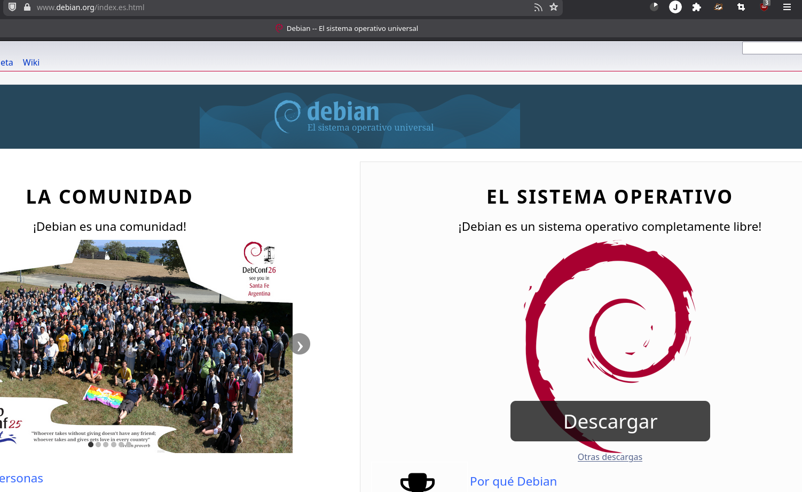

<Aqui va una instalacion de debian siguiendo los pasos del documento despliegue_desde0.md>

## DESPLIEGUE AUTOMATIZADO (install.sh)
Antes de comenzar la instalacion automatizada debemos comprobar que nuestro sistema tiene instalado el paquete `git` y `wget`, en caso contrario instalarlo usando nuestro instalador de paquetes 
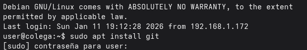
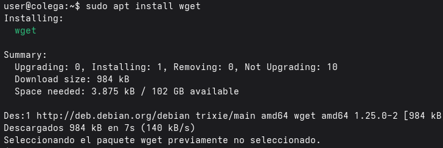

En el repositorio de Github encontraremos un comando que descargara el script de instalacion del servicio, se esta dando por hecho que tenemos una conexion ssh con el equipo en el que se va a desplegar el servicio, por lo que solo debemos copiar el comando y pegarlo en la terminal remota que tengamos en uso 
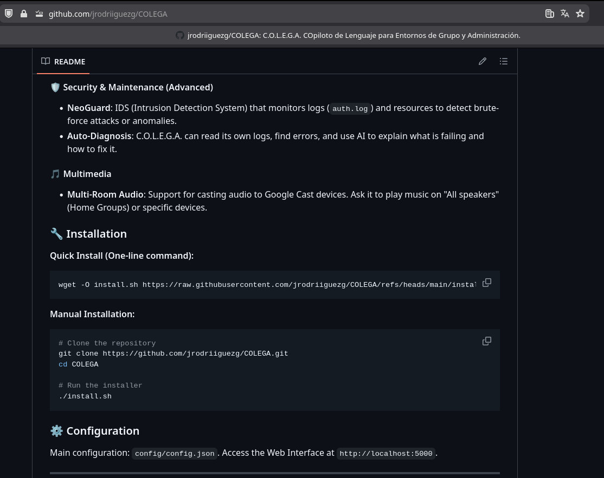

Pegaremos el comando de instalacion en la terminal y pulsaremos enter, el script es interactivo, preguntara varias cosas al usuario segun la instalacion que se vaya a hacer y pedira la clave de sudo cuando sea necesario (esta instalacion requiere conexion a internet y puede llevar hasta 1 hora)
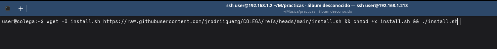

En las siguientes imagenes podemos ver algunas de las opciones que da el instalador asi como su funcionamiento

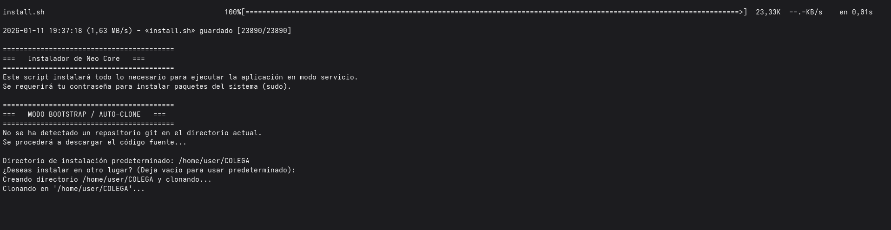
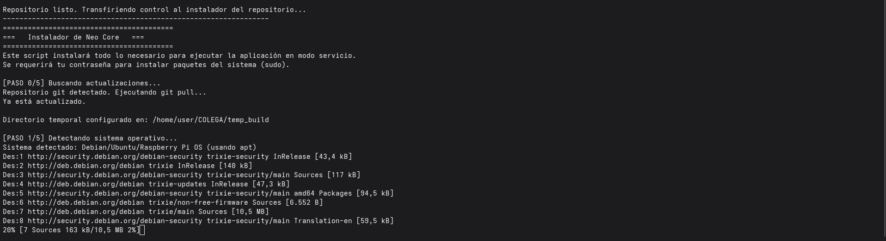
El script incluye una serie de optimizaciones para sistemas debian para hacerlos mas ligeros en cuanto al consumo de recursos

Instala todas las dependecias y paquetes de manera automatica 
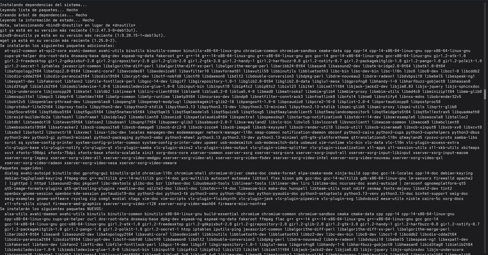
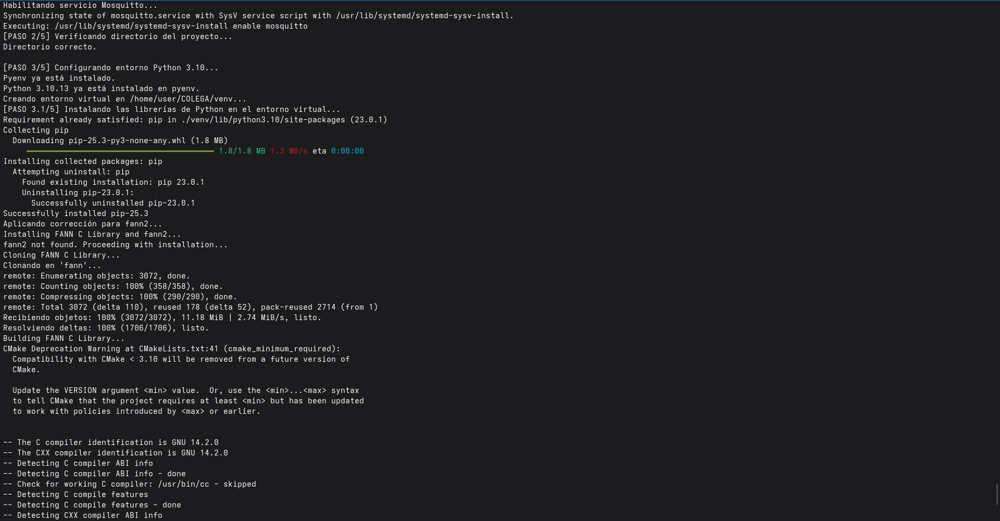

La parte mas lenta es la descarga de librerias de python 
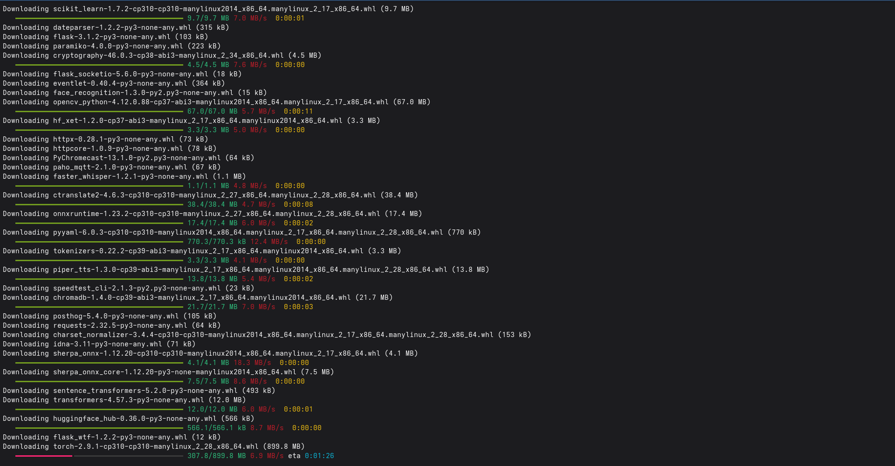
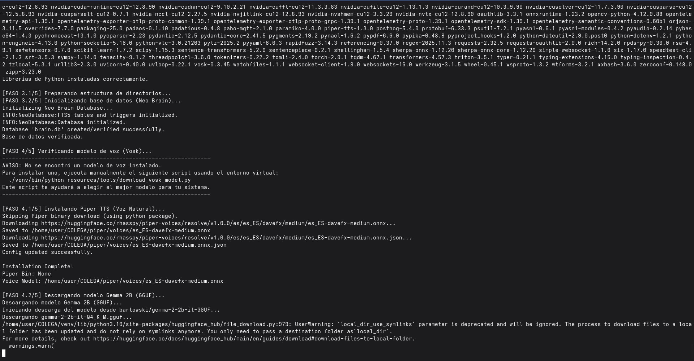
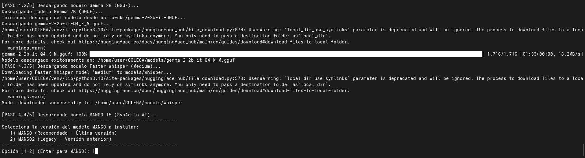
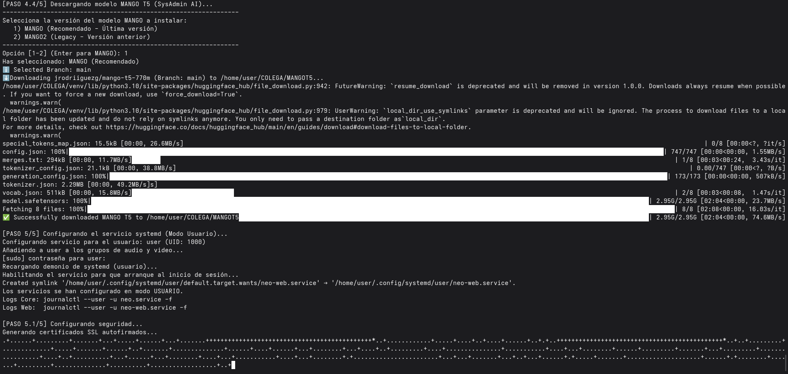

